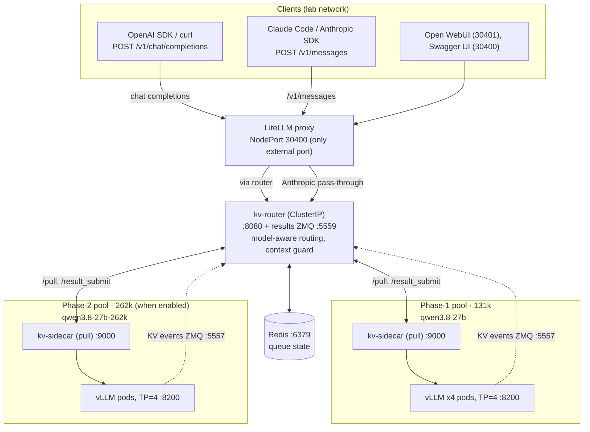

# SIR LLM Platform

Self-hosted LLM serving: **Qwen3.8-27B** on **Huawei Ascend 910B NPUs** —
**vLLM** + KV-aware router + **LiteLLM** gateway, Prometheus/Grafana
monitoring. Client how-tos:
[claude-code](claude-code/README.md) · [pi](pi/README.md) ·
[deepseek-harness](deepseek-harness/README.md) ·
[monitoring](monitoring/README.md).

## Models & pools

Same weights, two hardware pools. The `model` field in the request body picks
the pool — one base URL on both API paths.

| Model name | Pool | Context |
|------------|------|---------|
| `qwen3.8-27b` | phase-1 (4 pods × TP=4, 910B) | 131,072 — default |
| `qwen3.8-27b-262k` | phase-2 (910B3 64 GB HBM) | 262,144 — long context, off by default |
| `qwen3.8-27b-131k` | phase-1 alias | 131,072 — OpenAI path only |

## Architecture

[**🖼 Architecture diagram — two deployments, one gateway**](docs/architecture.png)
(PNG; editable source: [docs/architecture.svg](docs/architecture.svg))



## Quick start

One base URL for everything: **`http://<NODE_IP>:30400`** (any cluster node)
with the shared lab key **`sk-qwen38b-local`**. Pick a pool
via the `model` field: `qwen3.8-27b` (131k, default) or
`qwen3.8-27b-262k` (262k, long context). Standard `openai` / `anthropic`
SDKs work as-is (`base_url=…:30400/v1` and `…:30400` respectively).

### Claude Code

Claude Code uses the Anthropic path (`/v1/messages`):

```bash
cp claude-code/settings.qwen3-8b.json ~/.claude/settings.json   # back up first if needed
claude -p "Reply with PONG"                                     # verify
```

Exact `~/.claude/settings.json`:

```json
{
  "env": {
    "DISABLE_TELEMETRY": "1",
    "DISABLE_ERROR_REPORTING": "1",
    "CLAUDE_CODE_DISABLE_NONESSENTIAL_TRAFFIC": "1",
    "MCP_TIMEOUT": "60000",
    "ANTHROPIC_API_KEY": "sk-qwen38b-local",
    "ANTHROPIC_BASE_URL": "http://<NODE_IP>:30400",
    "ANTHROPIC_MODEL": "qwen3.8-27b",
    "ANTHROPIC_DEFAULT_HAIKU_MODEL": "qwen3.8-27b",
    "ANTHROPIC_DEFAULT_SONNET_MODEL": "qwen3.8-27b-262k",
    "ANTHROPIC_DEFAULT_OPUS_MODEL": "qwen3.8-27b",
    "ANTHROPIC_SMALL_FAST_MODEL": "qwen3.8-27b",
    "CLAUDE_CODE_DISABLE_1M_CONTEXT": "1",
    "CLAUDE_CODE_AUTO_COMPACT_WINDOW": "131072",
    "CLAUDE_CODE_MAX_OUTPUT_TOKENS": "8192",
    "HTTP_PROXY": "http://127.0.0.1:3128",
    "HTTPS_PROXY": "http://127.0.0.1:3128",
    "http_proxy": "http://127.0.0.1:3128",
    "https_proxy": "http://127.0.0.1:3128",
    "NO_PROXY": "127.0.0.1,127.0.0.*,localhost,*.huawei.com,<NODE_IP>"
  },
  "model": "sonnet",
  "enabledPlugins": {
    "cc-demo-plugin@rtos-cc-marketplace": true
  },
  "outputStyle": "engineer-professional",
  "skipWebFetchPreflight": true,
  "theme": "dark"
}
```

- **`CLAUDE_CODE_AUTO_COMPACT_WINDOW` is required** — without it Claude Code
  assumes a 200k window and long sessions die with
  `500 … maximum context length is 131072`. The template's `131072` trigger
  (≈110k) is safe on both pools; on the 262k pool (the default below) raise it
  to `240000` to use the full window (env is read at session start).
- The template pins the session to the **sonnet tier → 262k pool**
  (`"model": "sonnet"`); everything else stays on 131k. Pin
  `"qwen3.8-27b"` explicitly to stay on 131k.
- The `*_PROXY` lines and `enabledPlugins` are workstation-specific — drop
  them if your machine reaches the cluster directly.

### pi

pi uses the OpenAI path (`/v1/chat/completions`):

```bash
mkdir -p ~/.pi/agent
cp pi/models.json    ~/.pi/agent/models.json   # merge the "sirlab" entry if the file already has providers
cp pi/settings.json  ~/.pi/agent/settings.json
pi --list-models qwen      # should list sirlab / qwen3.8-27b
pi -p "Reply with PONG"    # verify
```

Exact `~/.pi/agent/models.json`:

```json
{
  "providers": {
    "sirlab": {
      "baseUrl": "http://<NODE_IP>:30400/v1",
      "api": "openai-completions",
      "apiKey": "sk-qwen38b-local",
      "compat": {
        "supportsReasoningEffort": false,
        "thinkingFormat": "qwen-chat-template"
      },
      "models": [
        {
          "id": "qwen3.8-27b",
          "name": "Qwen3.8 27B",
          "reasoning": true,
          "input": ["text", "image"],
          "contextWindow": 131072,
          "maxTokens": 8192
        },
        {
          "id": "qwen3.8-27b-131k",
          "name": "Qwen3.8 27B (131k context, 32G pool)",
          "reasoning": true,
          "input": ["text", "image"],
          "contextWindow": 131072,
          "maxTokens": 8192
        },
        {
          "id": "qwen3.8-27b-262k",
          "name": "Qwen3.8 27B (262k context, 64G pool)",
          "reasoning": true,
          "input": ["text", "image"],
          "contextWindow": 262144,
          "maxTokens": 8192
        }
      ]
    }
  }
}
```

Exact `~/.pi/agent/settings.json`:

```json
{
  "defaultProvider": "sirlab",
  "defaultModel": "qwen3.8-27b-131k",
  "enableInstallTelemetry": false,
  "theme": "dark",
  "quietStartup": true,
  "compaction": {
    "enabled": true,
    "reserveTokens": 32768,
    "keepRecentTokens": 20000
  },
  "defaultThinkingLevel": "high"
}
```

- **Don't raise `maxTokens: 8192`** — pi's input wall is
  `contextWindow − maxTokens`; stock values shrink it to ~33k and long
  sessions die there.
- The compaction settings trigger at ~98k tokens, so 131k-pool sessions run
  to ~122k input (262k pool: ~254k) and compact cleanly instead of failing
  with `prompt is too long`.
- `models.json` is reloaded when you open `/model` in a session — live-edit
  without restart.

---

Internal use only — Clyde Org
