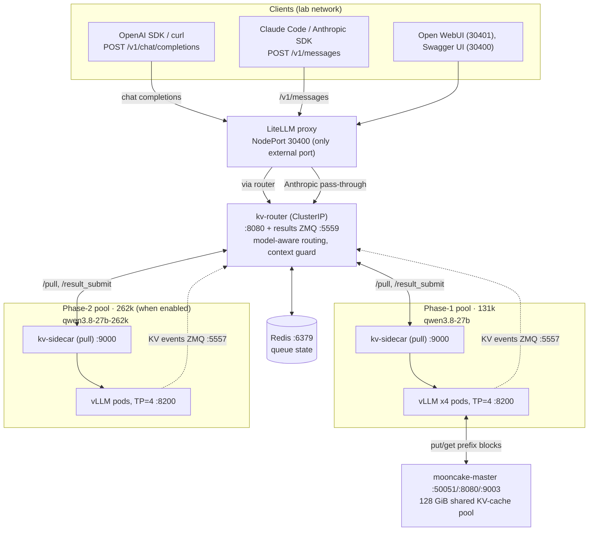
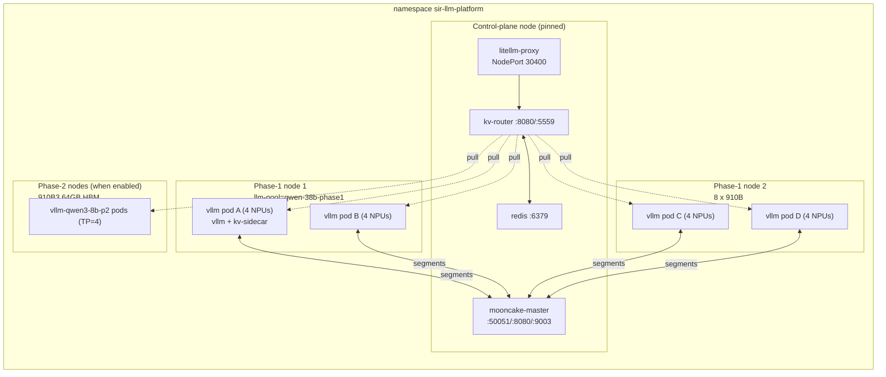
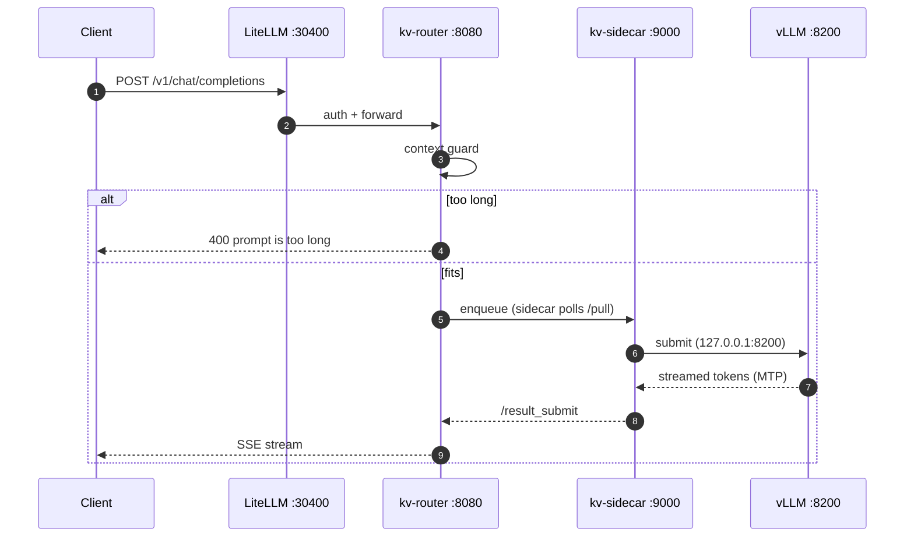

# SIR LLM Platform

Self-hosted LLM serving: **Qwen3.8-27B** on **Huawei Ascend 910B NPUs** —
**vLLM** + KV-aware router + **LiteLLM** gateway, Mooncake KV-cache store,
Prometheus/Grafana monitoring. Client how-tos:
[claude-code](claude-code/README.md) · [pi](pi/README.md) ·
[deepseek-harness](deepseek-harness/README.md) ·
[monitoring](monitoring/README.md).

## Models & pools

Same weights, two hardware pools. The `model` field in the request body picks
the pool — one base URL on both API paths.

| Model name | Pool | Context |
|------------|------|---------|
| `qwen3.8-27b` | phase-1 (4 pods × TP=4, 910B) | 131,072 — default |
| `qwen3.8-27b-262k` | phase-2 (910B3 64 GB HBM) | 262,144 — long context, off by default |
| `qwen3.8-27b-131k` | phase-1 alias | 131,072 — OpenAI path only |

## Architecture



- **One external port**: LiteLLM NodePort **30400**; everything else is
  ClusterIP (`kubectl port-forward` to poke internals).
- **Pull dispatch**: each vLLM pod's `kv-sidecar` polls `/pull` (50 ms) and
  posts results back via `/result_submit`; queue state in Redis.
- **Two API paths**: `/v1/chat/completions` is routed; `/v1/messages` is an
  authenticated verbatim pass-through to the router's model-aware forward
  (vLLM speaks the Anthropic Messages API natively).
- **KV cache, 3 tiers**: local prefix cache → router KV-affinity (per-pod KV
  events) → Mooncake 128 GiB DRAM pool shared across pods (phase-1 only).
- **Context guard**: requests that can't fit the pool get a real 400
  (`prompt is too long: …`) up front, so agent clients auto-compact.



Each vLLM pod is two containers (`vllm` + `kv-sidecar`) requesting 4 NPUs
(`huawei.com/Ascend910: 4` — disjoint sets per pod via the device plugin).
Weights are a pre-staged read-only hostPath (`/data/models/Qwen3.8-27B`);
nothing is downloaded at startup.



### Components & ports

| Service | Port(s) | Exposure | Role |
|---------|---------|----------|------|
| `litellm-proxy` | 4000 → **NodePort 30400** | external | API gateway (only external port) |
| `router-service` | 8080, 5559 (ZMQ) | ClusterIP | routing + results |
| `redis` | 6379 | ClusterIP | queue state |
| `vllm-qwen3-8b` | 8200 | ClusterIP | vLLM (phase-1) |
| `vllm-qwen3-8b-claude` | 8200 | ClusterIP | Anthropic-path upstream (unauthenticated, internal) |
| `vllm-qwen3-8b-p2` | 8200 | ClusterIP | phase-2 pool (when enabled) |
| `mooncake-master` | 50051, 8080, 9003 | ClusterIP | KV-store control plane |
| `open-webui` | 3000 → **NodePort 30401** | external | chat GUI |
| Prometheus / Grafana | **NodePort 30900 / 30300** | external | monitoring |

### Mooncake

- `mooncake-master` holds object index + segment metadata; **in-memory and
  stateless** — restart the master **first**, then roll the vLLM pods.
- Segments: 8 GiB × 4 TP ranks × 4 pods = **128 GiB** (phase-1 only; phase-2
  is deliberately mooncake-free).
- Must run `protocol: "ascend"` + `AscendStoreConnector` on this image (the
  generic `tcp` path registers fine but every put fails).
- Health: `master_active_clients` = 16; `master_batch_put_end` tracks
  `master_batch_put_start`.

## Quick setup

Prereqs: `kubectl` + Helm 3.x; 2 nodes labeled `llm-pool=qwen-38b-phase1`
(8 × 910B each); optional phase-2 nodes `llm-pool=qwen-38b-phase2`; Ascend
device plugin; weights pre-staged at `/data/models/Qwen3.8-27B/` on all vLLM
nodes. If a node can't pull from ghcr.io (egress MITM), add the CA first:
`cp /etc/pki/ca-trust/extracted/pem/tls-ca-bundle.pem /etc/containerd/certs.d/ghcr.io/ca.crt`.

### 1. Serving stack

```bash
helm upgrade --install vllm ./vllm-stack \
  -n sir-llm-platform --create-namespace \
  --set mooncake.enabled=true --set mooncake.attachToVllm=true
```

Chart defaults reproduce the live deployment; the two `mooncake` flags are the
only live overrides. Creates (ns `sir-llm-platform`): `redis`,
`router-service`, `vllm-qwen3-8b` (×4), `litellm-proxy` (NodePort 30400),
`vllm-qwen3-8b-claude`, `mooncake-master` + their ConfigMaps.

### 2. Monitoring

```bash
helm upgrade --install prometheus prometheus-community/kube-prometheus-stack \
  -n monitoring --create-namespace -f monitoring/prometheus/values.yaml
kubectl apply -f monitoring/npu-exporter.yaml
kubectl apply -f monitoring/servicemonitors.yaml
kubectl apply -f monitoring/dashboards/sir-llm-platform-vllm-configmap.yaml
```

### 3. Chat GUI (optional)

```bash
kubectl apply -f deepseek-harness/open-webui.yaml   # → NodePort 30401, first account = admin
```

### First boot & verification

vLLM model load on NPUs is slow (startup probe allows ~6 h) — a long `Running`
window before Ready is normal. Once all 4 phase-1 pods are Ready:

```bash
# smoke test (expect PONG)
curl -s -X POST http://<NODE_IP>:30400/v1/chat/completions \
  -H "Content-Type: application/json" -H "Authorization: Bearer sk-qwen38b-local" \
  -d '{"model": "qwen3.8-27b", "messages": [{"role": "user", "content": "Reply with PONG"}], "max_tokens": 32}'

# model list
curl -s -H "Authorization: Bearer sk-qwen38b-local" http://<NODE_IP>:30400/v1/models

# mooncake: expect 16 clients (4 pods x 4 TP ranks)
curl -s "http://<NODE_IP>:30900/api/v1/query?query=master_active_clients"

# overflow contract test (both pools, both paths; stdlib-only)
python3 scripts/test-ctx-guard.py
```

### Phase-2 rollout (optional)

Helm values are **replaced, not merged** — re-pass the mooncake flags on every
upgrade. Validate with one pod first (`--set phase2.pinnedNode=node3`, no
replicas/maxModelLen), then:

```bash
helm upgrade vllm ./vllm-stack -n sir-llm-platform \
  --set mooncake.enabled=true --set mooncake.attachToVllm=true \
  --set phase2.enabled=true --set phase2.replicas=4 --set phase2.maxModelLen=262144
```

Phase-2 pods serve `qwen3.8-27b-262k`, are mooncake-free, and join the same
router/sidecar machinery automatically.

### Day-2 operations

```bash
helm get values vllm -n sir-llm-platform   # before upgrading: re-apply these + new flags
kubectl rollout restart deployment/vllm-qwen3-8b -n sir-llm-platform   # slow (model load)
kubectl scale deployment/vllm-qwen3-8b -n sir-llm-platform --replicas=4
kubectl logs -n sir-llm-platform -l app=vllm-qwen3-8b --tail=100
kubectl logs -n sir-llm-platform <pod> -c kv-sidecar --tail=100
kubectl -n sir-llm-platform port-forward svc/router-service 8080:8080   # also: redis, vllm-qwen3-8b, mooncake-master
```

- Router/sidecar images are tag-pinned and **roll together** (shared wire contract).
- Rollback: `helm rollback vllm <rev> -n sir-llm-platform`, or detach mooncake
  (`--set mooncake.attachToVllm=false`), or disable phase-2
  (`--set phase2.enabled=false`).
- `vllm-stack/values/` holds stale files from an older schema — don't use them.

## Quick user guide

### Access

| What | Value |
|------|-------|
| Base URL | `http://<NODE_IP>:30400` (any node, e.g. `7.242.101.107`) |
| API key | `sk-qwen38b-local` (LiteLLM master key — **not** an Anthropic key) |
| OpenAI path | `POST /v1/chat/completions` + `Authorization: Bearer <key>` |
| Anthropic path | `POST /v1/messages` + `x-api-key: <key>` + `anthropic-version: 2023-06-01` |

Standard `openai` / `anthropic` SDKs work as-is (`base_url=…:30400/v1` and
`…:30400` respectively). Streaming, tool calling and reasoning parsing are
enabled.

Pick a pool by setting the `model` field. On overflow the gateway returns a
real 400 (`prompt is too long: …`) which agent clients handle by
auto-compacting; a session already past the limit needs a fresh start
(`/clear` in Claude Code).

### Coding agents

| Client | Path | Setup | Details |
|--------|------|-------|---------|
| **Claude Code** | `/v1/messages` | `cp claude-code/settings.qwen3-8b.json ~/.claude/settings.json` | [claude-code/README.md](claude-code/README.md) |
| **pi** | `/v1/chat/completions` | `cp pi/models.json pi/settings.json ~/.pi/agent/` | [pi/README.md](pi/README.md) |

Templates are pre-tuned for the 131k pool — don't use stock client context
settings (they assume 200k and long sessions 500).

### Chat GUIs

- **Open WebUI**: `http://<NODE_IP>:30401` (already deployed; first account = admin)
- **Swagger UI**: `http://<NODE_IP>:30400/` (API playground)
- **deepseek-chat**: `cd deepseek-harness && ./deepseek-chat` (stdlib-only REPL)
- Any other OpenAI-compatible client: base `http://<NODE_IP>:30400/v1`, key `sk-qwen38b-local`

### Monitoring

Prometheus `http://<NODE_IP>:30900` · Grafana `http://<NODE_IP>:30300`
(`admin` / `prometheus-admin`) · dashboard
`http://<NODE_IP>:30300/d/sir-llm-platform-vllm`. Metric reference and PromQL:
[monitoring/README.md](monitoring/README.md).

## Troubleshooting

| Symptom | Fix |
|---------|-----|
| 401 from gateway | auth header: `Authorization: Bearer sk-qwen38b-local` (or `x-api-key` on `/v1/messages`) |
| vLLM pods slow to Ready | normal — NPU model load; probe allows ~6 h |
| Claude Code: 500 `maximum context length is 131072` | session too long → `/clear`; [claude-code/README.md](claude-code/README.md) |
| Agent stalls with empty replies on long context | `python3 scripts/test-ctx-guard.py` — expect real 400s, not fake 200s |
| `/v1/messages` 404 for `qwen3.8-27b-131k` | alias is OpenAI-path only — use `qwen3.8-27b` |
| vLLM crash loop: `Address already in use` / Mooncake init failed | keep `mooncake.legacyRpcPortBinding: false` |
| Mooncake: `put_end ≈ 0` / external hit rate 0.0% | needs `AscendStoreConnector` + `protocol: "ascend"` |
| Stale mooncake segments after restarts | restart mooncake-master **first**, then roll vLLM pods |
| LiteLLM config change didn't apply | `kubectl rollout restart deployment/litellm-proxy` |
| New node can't pull from ghcr.io | add egress CA — see [Quick setup](#quick-setup) |

## Security

- Gateway auth is the static key `sk-qwen38b-local` on the lab network only —
  treat the repo as lab-internal; put a real gateway in front before it
  leaves the lab.
- The `-claude` Service and Redis have no auth; both are ClusterIP-only.

## Repository structure

```
sir-llm-platform/
├── README.md                        # ← this documentation
├── vllm-stack/                      # Helm chart (whole serving stack)
│   ├── values.yaml                  # defaults reproduce the live deployment
│   └── templates/                   # 01-configmap … 09-vllm-phase2
├── monitoring/                      # Prometheus values, NPU exporter, monitors, dashboards
├── claude-code/                     # Claude Code settings template
├── pi/                              # pi models.json / settings.json templates
├── deepseek-harness/                # minimal chat CLI + Open WebUI manifest
└── scripts/test-ctx-guard.py        # overflow contract test
```

Internal use only — Clyde Org
