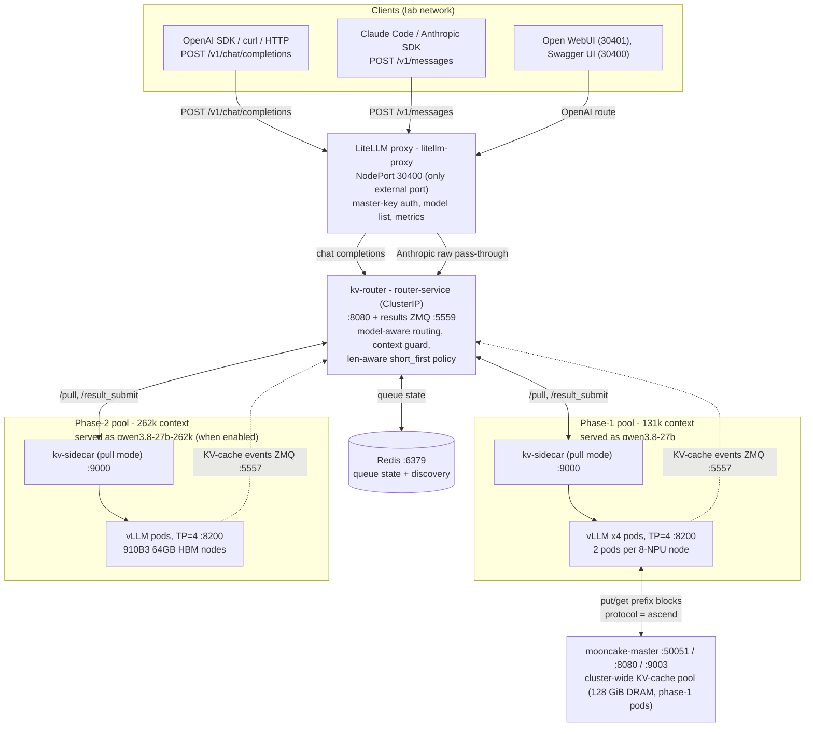
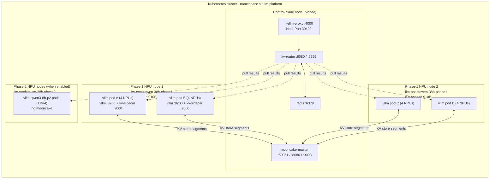
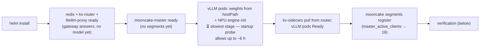
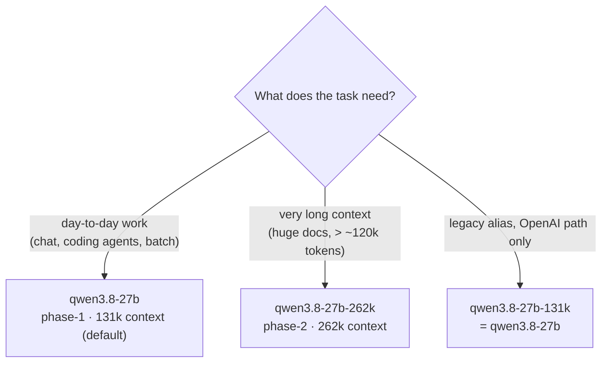

# SIR LLM Platform

Self-hosted LLM serving: **Qwen3.8-27B** on **Huawei Ascend 910B NPUs**, running
**vLLM** behind a **KV-aware router** and a **LiteLLM** gateway, with a
cluster-wide **Mooncake** KV-cache store and **Prometheus/Grafana** monitoring.
Out-of-the-box client configs for **Claude Code**, **pi**, and chat GUIs.

This README is the platform documentation: architecture, quick setup, quick user
guide. Per-client how-tos live in their subdirectory READMEs:
[claude-code](claude-code/README.md) · [pi](pi/README.md) ·
[deepseek-harness](deepseek-harness/README.md) · [monitoring](monitoring/README.md).

## Models & pools

The same Qwen3.8-27B weights are served from two hardware pools under different
names. The `model` field in the request body selects the pool on **both** API
paths — there is only ever one base URL.

| Model name | Pool | Context limit | Notes |
|------------|------|---------------|-------|
| `qwen3.8-27b` | phase-1 (4 pods × TP=4, Ascend 910B) | 131,072 | the default |
| `qwen3.8-27b-262k` | phase-2 (910B3, 64 GB HBM) | 262,144 | long-context work; off by default |
| `qwen3.8-27b-131k` | phase-1 (alias) | 131,072 | **OpenAI path only** (404 on `/v1/messages`) |

## Architecture

### Overview



Key properties:

- **One external port.** LiteLLM (NodePort **30400**) is the only exposed
  service; router, Redis, vLLM and Mooncake are ClusterIP-only (use
  `kubectl port-forward` to poke them).
- **Pull-based dispatch.** Each vLLM pod runs a `kv-sidecar` that polls the
  router's `/pull` every 50 ms and posts finished work back via
  `/result_submit`. The router keeps a central queue (state in Redis); busy
  pods simply stop pulling.
- **Two API paths, one gateway.** `/v1/chat/completions` (OpenAI) is routed
  through the router; `/v1/messages` (Anthropic) is an authenticated
  pass-through to the router's model-aware forward endpoint. vLLM speaks the
  Anthropic Messages API natively — the request and (streaming) response are
  forwarded verbatim, no protocol conversion anywhere.
- **KV cache, three tiers.** ① local prefix cache inside each vLLM pod;
  ② router KV-affinity — a request is steered to the pod that already holds
  its prefix (the router learns this from per-pod KV-cache events over
  ZMQ :5557); ③ the **Mooncake** store — a 128 GiB DRAM pool shared across
  pods, so prefix blocks survive local eviction and cross-pod routing
  (attached to phase-1 pods only).
- **Context guard.** Requests that cannot fit the pool's context window are
  rejected up front with a real **400** (`prompt is too long: N tokens > M
  maximum`, vLLM's error shape) — so agent clients (Claude Code, pi) detect
  overflow and auto-compact + continue instead of receiving a silent empty
  reply.
- **Per-pool limits are live.** Each vLLM endpoint declares its
  `max_model_len` to the router; the context cap is never hard-coded.

### Kubernetes topology



- **NPU allocation:** each vLLM pod requests `huawei.com/Ascend910: 4`; the
  Ascend device plugin gives each pod a disjoint set of 4 of the node's 8
  NPUs, so two TP=4 pods per node never collide.
- **Every vLLM pod is two containers:** `vllm` and `kv-sidecar`.
- **Model weights** are a pre-staged read-only hostPath
  (`/data/models/Qwen3.8-27B`) — nothing is downloaded at startup.
- **Pinning:** LiteLLM, router, Redis and mooncake-master are pinned to one
  node; vLLM pods are scheduled by the `llm-pool` node label.

### Request flow (OpenAI path)

```mermaid
sequenceDiagram
    autonumber
    participant C as Client
    participant L as LiteLLM :30400
    participant R as kv-router :8080
    participant S as kv-sidecar :9000
    participant V as vLLM :8200

    C->>L: POST /v1/chat/completions (model, messages, max_tokens)
    L->>L: master-key auth; model name resolution (alias rewrite)
    L->>R: forward to router-service:8080/v1
    R->>R: context guard: count prompt tokens
    alt prompt + max_tokens > pool max_model_len
        R-->>C: 400 "prompt is too long: N tokens > M maximum"
    else request fits
        R->>S: enqueue (sidecar polls /pull every 50ms)
        S->>V: submit to local vLLM (127.0.0.1:8200)
        V-->>S: streamed tokens (MTP speculative decoding)
        S-->>R: post results (/result_submit)
        R-->>C: SSE stream (via LiteLLM)
    end
```

The Anthropic path (`/v1/messages`) is the same chain minus routing: LiteLLM
authenticates and forwards the body verbatim to the router, which looks the
`model` field up in its upstream map and raw-streams to that pool's vLLM
service.

### Components & ports

| Service | Port(s) | Exposure | Role |
|---------|---------|----------|------|
| `litellm-proxy` | 4000 → **NodePort 30400** | external | API gateway (the only external port) |
| `router-service` | 8080 (http), 5559 (results ZMQ) | ClusterIP | routing + results channel |
| `redis` | 6379 | ClusterIP | router queue state |
| `vllm-qwen3-8b` | 8200 | ClusterIP | vLLM OpenAI API (phase-1) |
| `vllm-qwen3-8b-claude` | 8200 | ClusterIP | same pods; Anthropic-path upstream (unauthenticated, internal) |
| `vllm-qwen3-8b-p2` | 8200 | ClusterIP | phase-2 pool (when enabled) |
| `mooncake-master` | 50051 (rpc), 8080 (metadata), 9003 (metrics) | ClusterIP | KV-store control plane |
| `open-webui` | 3000 → **NodePort 30401** | external | chat GUI |
| Prometheus | 9090 → **NodePort 30900** | external | metrics |
| Grafana | 3000 → **NodePort 30300** | external | dashboards |

### Mooncake KV-cache store

- **master** (`mooncake-master`, 1 replica, pinned): owns the object index and
  segment metadata. **In-memory and stateless** — restarting it discards all
  registrations and keys. If it ever needs restarting: master **first**, then
  `kubectl rollout restart deployment/vllm-qwen3-8b` (stale segment
  registrations have no TTL and pod-IP reuse can shadow a live process).
- **Embedded segments:** with `mooncake.attachToVllm=true`, every vLLM TP rank
  in the phase-1 pool registers 8 GiB of node DRAM → **8 GiB × 4 ranks ×
  4 pods = 128 GiB**. Phase-2 pods are deliberately mooncake-free.
- **Transport:** must be `protocol: "ascend"` (the NPU-fabric transport) with
  the `AscendStoreConnector` on this vllm-ascend image. The generic `tcp`
  path is broken on this image (registration works, every put fails).
- **Health:** `master_active_clients` = 16 (4 pods × 4 ranks);
  `master_batch_put_end` should track `master_batch_put_start` (if
  `revoke ≈ start`, the data path is failing); vLLM log
  `External prefix cache hit rate` should be > 0 under shared-prefix load.

## Quick setup

Assumes cluster admin access. For *using* the platform, skip to
[Quick user guide](#quick-user-guide).

### Prerequisites

- `kubectl` + Helm 3.x configured against the cluster
- Nodes:
  - control plane: any schedulable node (pinned by hostname in the chart values)
  - phase-1: 2 nodes labeled `llm-pool=qwen-38b-phase1`, 8 × Ascend 910B each
  - phase-2 (optional): nodes labeled `llm-pool=qwen-38b-phase2` (910B3 64 GB HBM)
- The Ascend NPU device plugin running (pods request `huawei.com/Ascend910`)
- Model weights pre-staged on every vLLM node at `/data/models/Qwen3.8-27B/`
- Image egress: `kv-router`/`kv-sidecar`/`npu-exporter` come from
  `ghcr.io/clyde-org/llm-la-icbc`. If a node cannot pull from ghcr.io (egress
  MITM gateway), add the gateway CA to containerd first:
  `mkdir -p /etc/containerd/certs.d/ghcr.io && cp /etc/pki/ca-trust/extracted/pem/tls-ca-bundle.pem /etc/containerd/certs.d/ghcr.io/ca.crt`

### 1. Serving stack

```bash
helm upgrade --install vllm ./vllm-stack \
  -n sir-llm-platform --create-namespace \
  --set mooncake.enabled=true --set mooncake.attachToVllm=true
```

Everything else is chart default (`vllm-stack/values.yaml` reproduces the live
deployment); the **only** live overrides are the two `mooncake` flags, which
deploy the store master and attach the store connector to the vLLM pods.
Creates, in namespace `sir-llm-platform`:

| Resource | Kind | Notes |
|----------|------|-------|
| `model-registry`, `litellm-config`, `mooncake-store-config` | ConfigMaps | router registry + gateway + store config |
| `redis` | Deployment + Service | ClusterIP :6379, pinned |
| `router-service` | Deployment + Service + RBAC | ClusterIP :8080/:5559, pinned |
| `vllm-qwen3-8b` | Deployment (×4) + Service | phase-1 pods (vllm + kv-sidecar) |
| `litellm-proxy` | Deployment + Service | NodePort 30400, pinned |
| `vllm-qwen3-8b-claude` | Service | ClusterIP view of phase-1 pods (Anthropic upstream) |
| `mooncake-master` | Deployment + Service | :50051/:8080/:9003, pinned |

### 2. Monitoring

```bash
# Prometheus + Grafana (kube-prometheus-stack), namespace monitoring
helm upgrade --install prometheus prometheus-community/kube-prometheus-stack \
  -n monitoring --create-namespace \
  -f monitoring/prometheus/values.yaml

# NPU exporter DaemonSet, namespace npu-exporter
kubectl apply -f monitoring/npu-exporter.yaml

# Scrape monitors + litellm bearer secret, namespace monitoring
kubectl apply -f monitoring/servicemonitors.yaml

# Pre-provisioned dashboard (Grafana persistence is off; the ConfigMap is the source of truth)
kubectl apply -f monitoring/dashboards/sir-llm-platform-vllm-configmap.yaml
```

See [monitoring/README.md](monitoring/README.md) for the metric reference.

### 3. Chat GUI (optional)

```bash
kubectl apply -f deepseek-harness/open-webui.yaml
kubectl rollout status deploy/open-webui -n sir-llm-platform
```

NodePort **30401**; first registered account becomes admin. Uses `emptyDir`
(pod recreation resets the admin account and history).

### First boot



vLLM model loading on NPUs is slow — a long `Running` window before Ready is
normal; watch `kubectl logs` rather than the pod status.

### Verification

```bash
# gateway health
curl -s -H "Authorization: Bearer sk-qwen38b-local" http://<NODE_IP>:30400/health

# smoke test - OpenAI path
curl -s -X POST http://<NODE_IP>:30400/v1/chat/completions \
  -H "Content-Type: application/json" -H "Authorization: Bearer sk-qwen38b-local" \
  -d '{"model": "qwen3.8-27b", "messages": [{"role": "user", "content": "Reply with PONG"}], "max_tokens": 32}'

# smoke test - Anthropic path
curl -s -X POST http://<NODE_IP>:30400/v1/messages \
  -H "Content-Type: application/json" -H "x-api-key: sk-qwen38b-local" \
  -H "anthropic-version: 2023-06-01" \
  -d '{"model": "qwen3.8-27b", "max_tokens": 32, "messages": [{"role": "user", "content": "Reply with PONG"}]}'

# model list (shows both pools when phase-2 is enabled)
curl -s -H "Authorization: Bearer sk-qwen38b-local" http://<NODE_IP>:30400/v1/models

# mooncake: expect 16 active clients (4 pods x 4 TP ranks)
curl -s "http://<NODE_IP>:30900/api/v1/query?query=master_active_clients"
```

Client contract test (overflow behaviour, both pools, both paths; stdlib-only):

```bash
python3 scripts/test-ctx-guard.py             # all checks
CTX_TEST_SKIP_SLOW=1 python3 scripts/test-ctx-guard.py   # skip the ~115k-token prefill
```

### Phase-2 rollout (262k pool, optional)

Additive and off by default. Roll out in three steps — **Helm values are
replaced, not merged, so re-pass the mooncake flags on every upgrade**:

```bash
# 1. single-pod validation
helm upgrade vllm ./vllm-stack -n sir-llm-platform \
  --set mooncake.enabled=true --set mooncake.attachToVllm=true \
  --set phase2.enabled=true --set phase2.pinnedNode=node3

# 2. two pods per node
helm upgrade vllm ./vllm-stack -n sir-llm-platform \
  --set mooncake.enabled=true --set mooncake.attachToVllm=true \
  --set phase2.enabled=true --set phase2.replicas=4

# 3. raise the context limit to 262k
helm upgrade vllm ./vllm-stack -n sir-llm-platform \
  --set mooncake.enabled=true --set mooncake.attachToVllm=true \
  --set phase2.enabled=true --set phase2.replicas=4 \
  --set phase2.maxModelLen=262144
```

Phase-2 pods are served under `qwen3.8-27b-262k`, are deliberately
**mooncake-free**, and join the same router/sidecar machinery (discovered via
the shared `component=vllm` label).

### Day-2 operations

```bash
# upgrade (capture current overrides first, re-apply them + new flags)
helm get values vllm -n sir-llm-platform
helm upgrade vllm ./vllm-stack -n sir-llm-platform \
  --set mooncake.enabled=true --set mooncake.attachToVllm=true
helm history vllm -n sir-llm-platform

# restart / scale
kubectl rollout restart deployment/litellm-proxy -n sir-llm-platform
kubectl rollout restart deployment/router-service -n sir-llm-platform
kubectl rollout restart deployment/vllm-qwen3-8b -n sir-llm-platform   # rolling; slow (model load)
kubectl scale deployment/vllm-qwen3-8b -n sir-llm-platform --replicas=4

# logs (a vLLM pod has two containers)
kubectl logs -n sir-llm-platform -l app=vllm-qwen3-8b --tail=100
kubectl logs -n sir-llm-platform <pod> -c kv-sidecar --tail=100

# reach internal services from a workstation
kubectl -n sir-llm-platform port-forward svc/router-service 8080:8080
kubectl -n sir-llm-platform port-forward svc/redis 6379:6379
kubectl -n sir-llm-platform port-forward svc/vllm-qwen3-8b 8200:8200
```

- **Router/sidecar images are pinned by tag** (`values.yaml`:
  `router.imageTag` / `sidecar.imageTag`) and must be **rolled together** —
  they share a wire contract. Never `:latest`.
- `vllm-stack/values/` contains stale files from an older chart schema — do
  not use them.
- Rollback: `helm rollback vllm <rev> -n sir-llm-platform`, or detach mooncake
  (`--set mooncake.attachToVllm=false`), or disable phase-2
  (`--set phase2.enabled=false`).

## Quick user guide

### Access

| What | Value |
|------|-------|
| Gateway base URL | `http://<NODE_IP>:30400` (any reachable node, e.g. `7.242.101.107`) |
| API key | `sk-qwen38b-local` (LiteLLM master key — **not** an Anthropic key) |
| OpenAI path | `POST /v1/chat/completions`, header `Authorization: Bearer <key>` |
| Anthropic path | `POST /v1/messages`, headers `x-api-key: <key>` + `anthropic-version: 2023-06-01` |

### Your first call

```bash
curl -s -X POST http://<NODE_IP>:30400/v1/chat/completions \
  -H "Content-Type: application/json" \
  -H "Authorization: Bearer sk-qwen38b-local" \
  -d '{
    "model": "qwen3.8-27b",
    "messages": [{"role": "user", "content": "Hello"}],
    "max_tokens": 100
  }'
```

Python (official `openai` package):

```python
from openai import OpenAI

client = OpenAI(base_url="http://7.242.101.107:30400/v1", api_key="sk-qwen38b-local")
resp = client.chat.completions.create(
    model="qwen3.8-27b",
    messages=[{"role": "user", "content": "Hello"}],
    max_tokens=100,
)
print(resp.choices[0].message.content)
```

Anthropic path (official `anthropic` package works as-is):

```python
from anthropic import Anthropic

client = Anthropic(base_url="http://7.242.101.107:30400", api_key="sk-qwen38b-local")
msg = client.messages.create(
    model="qwen3.8-27b",
    max_tokens=100,
    messages=[{"role": "user", "content": "Hello"}],
)
print(msg.content[0].text)
```

Streaming (`stream=True`) works on both paths. Tool calling is enabled
(`qwen3_coder` parser) and reasoning parsing is active — the model can think
before answering.

### Choosing a pool



Just set the `model` field. Rules of thumb: keep `max_tokens` ≤ 8192; if a
request overflows the pool, the gateway returns a real **400**
(`prompt is too long: …`) — agent clients handle this by auto-compacting. A
session already past the limit can't be compacted back under it: start a fresh
one (`/clear` in Claude Code).

### Coding agents

| Client | Path | Setup | Details |
|--------|------|-------|---------|
| **Claude Code** | `/v1/messages` | `cp claude-code/settings.qwen3-8b.json ~/.claude/settings.json` | [claude-code/README.md](claude-code/README.md) |
| **pi** | `/v1/chat/completions` | `cp pi/models.json pi/settings.json ~/.pi/agent/` | [pi/README.md](pi/README.md) |

Both templates are pre-tuned for the 131k pool (autocompact / compaction
triggers set well under the hard limit) — don't use stock client defaults,
they assume 200k context and long sessions will 500.

### Chat GUIs & CLI

| Option | Where | Notes |
|--------|-------|-------|
| **Open WebUI** | `http://<NODE_IP>:30401` | already deployed; first account = admin |
| **LiteLLM Swagger UI** | `http://<NODE_IP>:30400/` | API playground, zero install |
| **deepseek-chat** | `cd deepseek-harness && ./deepseek-chat` | stdlib-only Python REPL, preconfigured |
| LibreChat / NextChat / AnythingLLM / LM Studio | self-host / desktop | any OpenAI-compatible client: base URL `http://<NODE_IP>:30400/v1`, key `sk-qwen38b-local` |

More GUI options: [deepseek-harness/README.md](deepseek-harness/README.md).

### Monitoring

| Service | URL | Credentials |
|---------|-----|-------------|
| Prometheus | `http://<NODE_IP>:30900` | — |
| Grafana | `http://<NODE_IP>:30300` | `admin` / `prometheus-admin` |
| Platform dashboard | `http://<NODE_IP>:30300/d/sir-llm-platform-vllm` | rows: Gateway, Router/SLO, load balancing, cache & speculative decoding, reliability, NPU hardware |

Useful PromQL:

```promql
rate(vllm:request_success_total[5m])                                # request rate
vllm:kv_cache_usage_perc                                           # KV cache pressure
router_central_queue_length                                        # router queue depth
histogram_quantile(0.95, rate(router_request_e2e_seconds_bucket[5m]))  # P95 E2E
master_allocated_bytes / master_total_capacity_bytes               # Mooncake pool fill
npu_chip_info_hbm_used_memory / npu_chip_info_hbm_total_memory     # HBM usage
```

## Troubleshooting quick reference

| Symptom | First check | Fix / notes |
|---------|-------------|-------------|
| 401 from the gateway | auth header | `Authorization: Bearer sk-qwen38b-local` (or `x-api-key` on `/v1/messages`) |
| vLLM pods take a long time to become Ready | `kubectl logs … -c vllm --tail=50` | normal — model load on NPU; startup probe allows ~6 h |
| Claude Code: `500 … maximum context length is 131072` | session too long | autocompact misfire class — fresh session (`/clear`); see [claude-code/README.md](claude-code/README.md) |
| Agent stalls with empty replies on long context | overflow handling | run `python3 scripts/test-ctx-guard.py`; expect real 400s, not fake 200s |
| `/v1/messages` 404 for `qwen3.8-27b-131k` | model name | alias is OpenAI-path only; use `qwen3.8-27b` on the Anthropic path |
| vLLM pod crash-loops: `Address already in use` / `Initialize MooncakeDistributedStore failed` | mooncake env | keep `mooncake.legacyRpcPortBinding: false` (auto ports + legacy mode = guaranteed EADDRINUSE) |
| Mooncake: segments registered but `put_end ≈ 0` / `External prefix cache hit rate: 0.0%` | connector/protocol | must be `AscendStoreConnector` + `protocol: "ascend"` on this image; `tcp` is the broken path |
| Stale mooncake segments after pod restarts | restart order | restart **mooncake-master first**, then `kubectl rollout restart deployment/vllm-qwen3-8b` |
| Router crash-loops | router logs | historical cause: missing tokenizer deps — it runs `KV_AWARE=false`; don't re-enable without the deps |
| LiteLLM config change didn't take effect | pod template | the `checksum/litellm-config` annotation should trigger a rollout; force with `kubectl rollout restart deployment/litellm-proxy` |
| New node can't pull images from ghcr.io | registry CA | `cp /etc/pki/ca-trust/extracted/pem/tls-ca-bundle.pem /etc/containerd/certs.d/ghcr.io/ca.crt` |
| Need to poke router/redis/vLLM directly | not exposed | `kubectl port-forward` — recipes in [Day-2 operations](#day-2-operations) |

## Security notes

- The gateway is protected **only** by the static master key
  `sk-qwen38b-local` on the lab network — anyone who knows it can call the
  model. The key is committed throughout this repo; treat the repo as
  lab-internal. Add a gateway/OAuth proxy in front if the platform ever leaves
  the lab.
- The `-claude` Service and the router's Redis have no auth; both are
  ClusterIP-only (reachable from inside the cluster or via port-forward).

## Repository structure

```
sir-llm-platform/
├── README.md                        # ← this documentation
├── vllm-stack/                      # Helm chart (the whole serving stack)
│   ├── values.yaml                  # defaults reproduce the live deployment
│   └── templates/
│       ├── 01-configmap.yaml        # model-registry + litellm-config
│       ├── 02-redis.yaml
│       ├── 03-router.yaml
│       ├── 04-vllm.yaml             # phase-1 vLLM pods (+ kv-sidecar)
│       ├── 05-litellm.yaml
│       ├── 06-claude-service.yaml
│       ├── 07-podmonitors.yaml
│       ├── 08-mooncake.yaml
│       ├── 09-vllm-phase2.yaml      # phase-2 (262k) pool, off by default
│       └── _helpers.tpl
├── monitoring/                      # README + Prometheus values, NPU exporter, monitors, dashboards
├── claude-code/                     # README + Claude Code settings template
├── pi/                              # README + pi models.json / settings.json templates
├── deepseek-harness/                # README + minimal chat CLI + Open WebUI manifest
└── scripts/
    └── test-ctx-guard.py            # client-side overflow contract test
```

## License

Internal use only - Clyde Org
