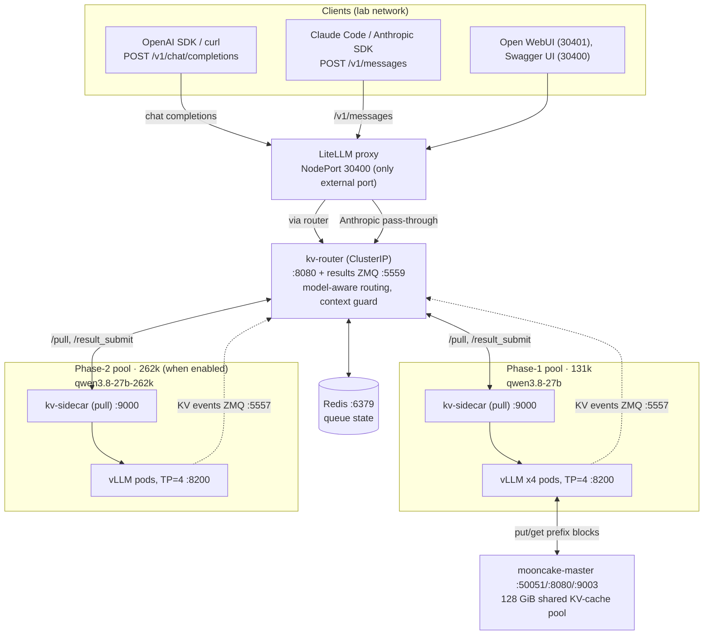
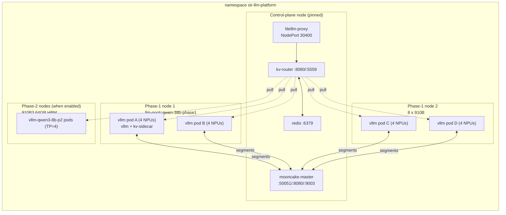
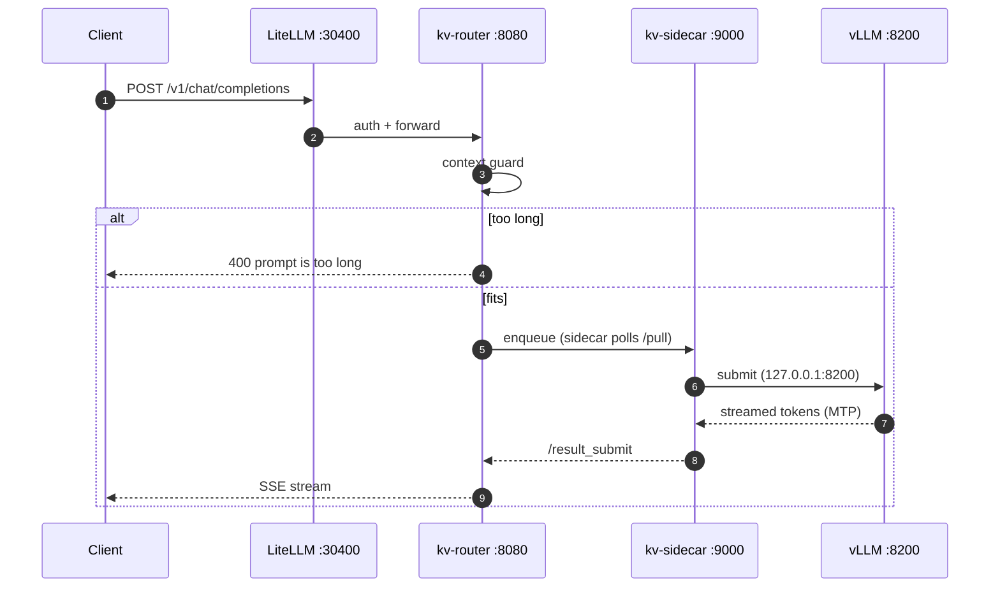

# SIR LLM Platform

Self-hosted LLM serving: **Qwen3.8-27B** on **Huawei Ascend 910B NPUs** —
**vLLM** + KV-aware router + **LiteLLM** gateway, Mooncake KV-cache store,
Prometheus/Grafana monitoring.

## Architecture



- **One external port**: LiteLLM NodePort **30400**; everything else is
  ClusterIP (`kubectl port-forward` to poke internals).
- **Pull dispatch**: each vLLM pod's `kv-sidecar` polls `/pull` (50 ms) and
  posts results back via `/result_submit`; queue state in Redis.
- **Two API paths**: `/v1/chat/completions` is routed; `/v1/messages` is an
  authenticated verbatim pass-through to the router's model-aware forward
  (vLLM speaks the Anthropic Messages API natively).
- **KV cache, 3 tiers**: local prefix cache → router KV-affinity (per-pod KV
  events) → Mooncake 128 GiB DRAM pool shared across pods (phase-1 only).
- **Context guard**: requests that can't fit the pool get a real 400
  (`prompt is too long: …`) up front, so agent clients auto-compact.



Each vLLM pod is two containers (`vllm` + `kv-sidecar`) requesting 4 NPUs
(`huawei.com/Ascend910: 4` — disjoint sets per pod via the device plugin).
Weights are a pre-staged read-only hostPath (`/data/models/Qwen3.8-27B`);
nothing is downloaded at startup.



### Components & ports

| Service | Port(s) | Exposure | Role |
|---------|---------|----------|------|
| `litellm-proxy` | 4000 → **NodePort 30400** | external | API gateway (only external port) |
| `router-service` | 8080, 5559 (ZMQ) | ClusterIP | routing + results |
| `redis` | 6379 | ClusterIP | queue state |
| `vllm-qwen3-8b` | 8200 | ClusterIP | vLLM (phase-1) |
| `vllm-qwen3-8b-claude` | 8200 | ClusterIP | Anthropic-path upstream (unauthenticated, internal) |
| `vllm-qwen3-8b-p2` | 8200 | ClusterIP | phase-2 pool (when enabled) |
| `mooncake-master` | 50051, 8080, 9003 | ClusterIP | KV-store control plane |
| `open-webui` | 3000 → **NodePort 30401** | external | chat GUI |
| Prometheus / Grafana | **NodePort 30900 / 30300** | external | monitoring |

### Mooncake

- `mooncake-master` holds object index + segment metadata; **in-memory and
  stateless** — restart the master **first**, then roll the vLLM pods.
- Segments: 8 GiB × 4 TP ranks × 4 pods = **128 GiB** (phase-1 only; phase-2
  is deliberately mooncake-free).
- Must run `protocol: "ascend"` + `AscendStoreConnector` on this image (the
  generic `tcp` path registers fine but every put fails).
- Health: `master_active_clients` = 16; `master_batch_put_end` tracks
  `master_batch_put_start`.

## Quick start

One base URL for everything: **`http://<NODE_IP>:30400`** (e.g.
`7.242.101.107`) with the shared lab key **`sk-qwen38b-local`**. Pick a pool
via the `model` field: `qwen3.8-27b` (131k, default) or
`qwen3.8-27b-262k` (262k, long context). Standard `openai` / `anthropic`
SDKs work as-is (`base_url=…:30400/v1` and `…:30400` respectively).

### Claude Code

Claude Code uses the Anthropic path (`/v1/messages`):

```bash
cp claude-code/settings.qwen3-8b.json ~/.claude/settings.json   # back up first if needed
claude -p "Reply with PONG"                                     # verify
```

Exact `~/.claude/settings.json`:

```json
{
  "env": {
    "DISABLE_TELEMETRY": "1",
    "DISABLE_ERROR_REPORTING": "1",
    "CLAUDE_CODE_DISABLE_NONESSENTIAL_TRAFFIC": "1",
    "MCP_TIMEOUT": "60000",
    "ANTHROPIC_API_KEY": "sk-qwen38b-local",
    "ANTHROPIC_BASE_URL": "http://7.242.101.107:30400",
    "ANTHROPIC_MODEL": "qwen3.8-27b",
    "ANTHROPIC_DEFAULT_HAIKU_MODEL": "qwen3.8-27b",
    "ANTHROPIC_DEFAULT_SONNET_MODEL": "qwen3.8-27b-262k",
    "ANTHROPIC_DEFAULT_OPUS_MODEL": "qwen3.8-27b",
    "ANTHROPIC_SMALL_FAST_MODEL": "qwen3.8-27b",
    "CLAUDE_CODE_DISABLE_1M_CONTEXT": "1",
    "CLAUDE_CODE_AUTO_COMPACT_WINDOW": "131072",
    "CLAUDE_CODE_MAX_OUTPUT_TOKENS": "8192",
    "HTTP_PROXY": "http://127.0.0.1:3128",
    "HTTPS_PROXY": "http://127.0.0.1:3128",
    "http_proxy": "http://127.0.0.1:3128",
    "https_proxy": "http://127.0.0.1:3128",
    "NO_PROXY": "127.0.0.1,127.0.0.*,localhost,*.huawei.com,7.242.101.107"
  },
  "model": "qwen3.8-27b",
  "enabledPlugins": {
    "cc-demo-plugin@rtos-cc-marketplace": true
  },
  "outputStyle": "engineer-professional",
  "skipWebFetchPreflight": true,
  "theme": "dark"
}
```

- **`CLAUDE_CODE_AUTO_COMPACT_WINDOW` is required** — without it Claude Code
  assumes a 200k window and long sessions die with
  `500 … maximum context length is 131072`. On the 262k pool raise it to
  `240000` (env is read at session start).
- The Sonnet tier is pointed at the 262k pool for long-context work;
  everything else stays on 131k.
- The `*_PROXY` lines and `enabledPlugins` are workstation-specific — drop
  them if your machine reaches the cluster directly.

### pi

pi uses the OpenAI path (`/v1/chat/completions`):

```bash
mkdir -p ~/.pi/agent
cp pi/models.json    ~/.pi/agent/models.json   # merge the "sirlab" entry if the file already has providers
cp pi/settings.json  ~/.pi/agent/settings.json
pi --list-models qwen      # should list sirlab / qwen3.8-27b
pi -p "Reply with PONG"    # verify
```

Exact `~/.pi/agent/models.json`:

```json
{
  "providers": {
    "sirlab": {
      "baseUrl": "http://7.242.101.107:30400/v1",
      "api": "openai-completions",
      "apiKey": "sk-qwen38b-local",
      "compat": {
        "supportsReasoningEffort": false,
        "thinkingFormat": "qwen-chat-template"
      },
      "models": [
        {
          "id": "qwen3.8-27b",
          "name": "Qwen3.8 27B",
          "reasoning": true,
          "input": ["text", "image"],
          "contextWindow": 131072,
          "maxTokens": 8192
        }
      ]
    }
  }
}
```

Exact `~/.pi/agent/settings.json`:

```json
{
  "defaultProvider": "sirlab",
  "defaultModel": "qwen3.8-27b",
  "enableInstallTelemetry": false,
  "theme": "dark",
  "quietStartup": true,
  "compaction": {
    "enabled": true,
    "reserveTokens": 32768,
    "keepRecentTokens": 20000
  }
}
```

- **Don't raise `maxTokens: 8192`** — pi's input wall is
  `contextWindow − maxTokens`; stock values shrink it to ~33k and long
  sessions die there.
- The compaction settings trigger at ~98k tokens, so sessions run to ~122k
  input and compact cleanly instead of failing with `prompt is too long`.
- `models.json` is reloaded when you open `/model` in a session — live-edit
  without restart.

---

Internal use only — Clyde Org
