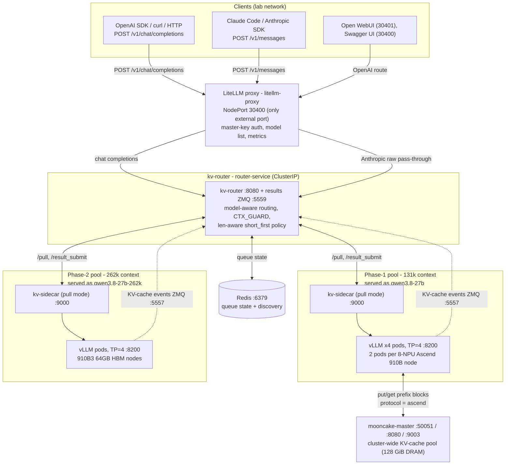
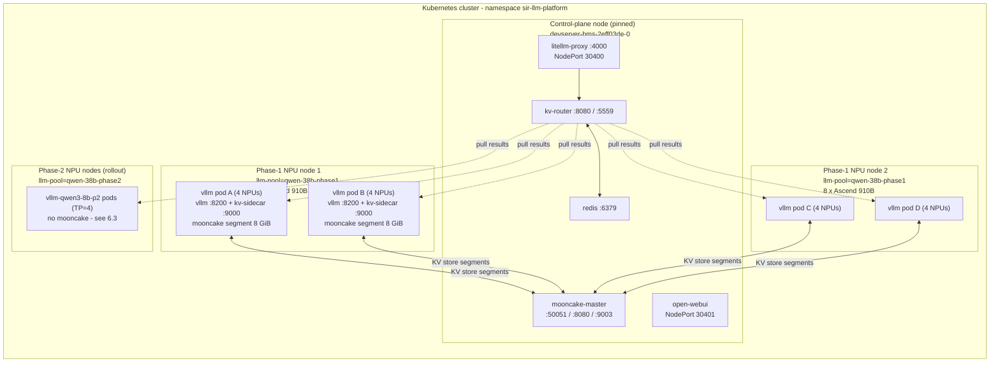
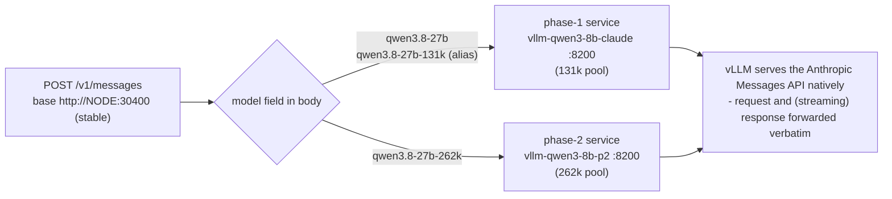
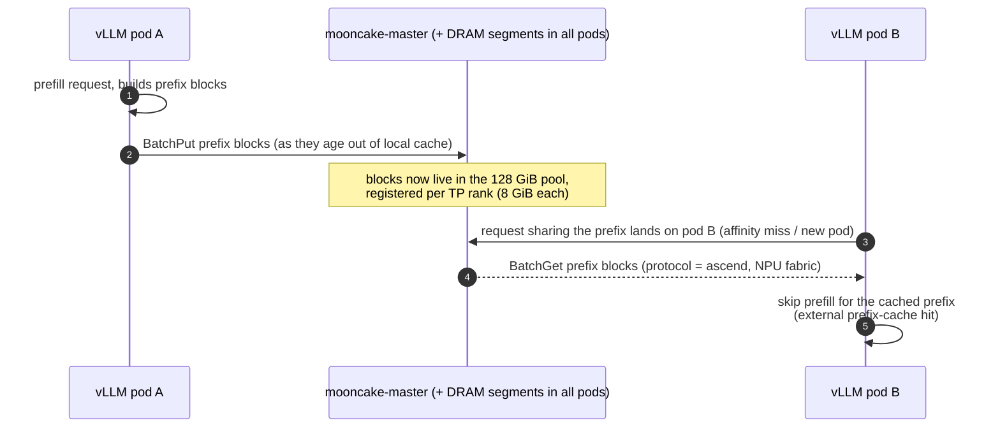
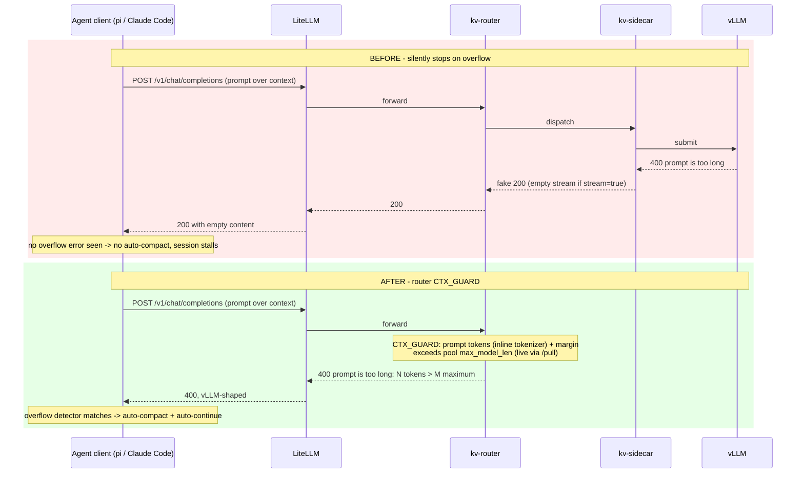
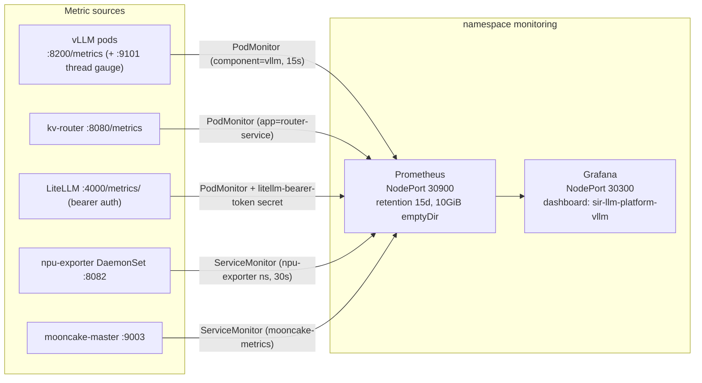

# Architecture

How the SIR LLM platform is put together, and why. All figures are Mermaid
(rendered by GitHub/GitLab; viewable as plain text otherwise).

## 1. System overview

The platform serves **one model (Qwen3.8-27B)** through **two hardware pools**,
behind **one gateway**. Every request — OpenAI-style or Anthropic-style — flows
`client → LiteLLM → kv-router → kv-sidecar → vLLM`.



Key properties:

- **One external port.** LiteLLM (NodePort 30400) is the only exposed service;
  router, Redis, vLLM and Mooncake are ClusterIP-only.
- **Pull-based dispatch.** The router keeps a central queue (state in Redis); each
  pod's `kv-sidecar` polls `/pull` every 50 ms and posts finished work back via
  `/result_submit` (`submit_ack` mode). This inverts the usual "router pushes to
  workers" design — workers that are busy simply stop pulling.
- **Per-pool limits are live.** Each vLLM endpoint declares its own
  `max_model_len` to the router (via `/pull`), so len-aware routing and the context
  guard enforce the right cap per pool with no static configuration.
- **Control plane pinned.** LiteLLM, router, Redis (and mooncake-master) are
  pinned to one node (`devserver-bms-2eff03de-0`); vLLM pods are scheduled by the
  `llm-pool` node label.

## 2. Kubernetes deployment topology



Notes:

- **NPU allocation:** each vLLM pod requests `huawei.com/Ascend910: 4`. The Ascend
  device plugin bind-mounts only the allocated `/dev/davinci*` devices into the pod,
  so `ASCEND_RT_VISIBLE_DEVICES=0,1,2,3` inside the pod always means "the 4
  allocated devices". Two TP=4 pods per node get disjoint physical NPU sets
  automatically.
- **Every vLLM pod is two containers:** `vllm` (the API server behind a bash wrapper
  that also serves a `vllm_threads` gauge on :9101) and `kv-sidecar`.
- **Model weights** are a read-only hostPath volume (`/data/models`, subPath
  `Qwen3.8-27B`) — pre-staged on the nodes, no image-embedded weights.

## 3. Request paths

### 3.1 OpenAI path — `/v1/chat/completions`

```mermaid
sequenceDiagram
    autonumber
    participant C as Client (OpenAI SDK / curl)
    participant L as LiteLLM :30400
    participant R as kv-router :8080
    participant S as kv-sidecar :9000
    participant V as vLLM :8200

    C->>L: POST /v1/chat/completions (model, messages, max_tokens)
    L->>L: master-key auth; model name resolution (alias rewrite)
    L->>R: forward to http://router-service:8080/v1
    R->>R: CTX_GUARD: count prompt tokens (inline tokenizer)
    alt prompt + max_tokens > pool max_model_len
        R-->>L: 400 "prompt is too long: N tokens > M maximum"
        L-->>C: 400 (vLLM-shaped error)
    else request fits
        R->>R: route: len-aware (short_first) + KV affinity
        R->>S: enqueue (sidecar polls /pull every 50ms)
        S->>V: submit to local vLLM (127.0.0.1:8200)
        V-->>S: streamed tokens (MTP speculative decoding)
        S-->>R: post results (/result_submit, submit_ack)
        R-->>L: streamed chunks
        L-->>C: SSE stream
    end
    Note over R,V: queue state in Redis; per-pod KV-cache events published<br/>over ZMQ :5557 (topic kv@<pod>@<model>) feed the router
```

### 3.2 Anthropic path — `/v1/messages` (model-aware pass-through)

Claude Code (and any Anthropic-SDK client) uses **one stable base URL**; the pool is
selected by the `model` field in the body, via the router's `ANTHROPIC_UPSTREAMS`
map (a JSON model→URL map rendered by the chart into the router's environment):



- LiteLLM's `/v1/messages` is a **pass-through endpoint**: it authenticates, then
  forwards body and stream verbatim — no translation.
- vLLM speaks the Anthropic Messages API natively, so no protocol conversion
  happens anywhere in the chain.
- The legacy static path `/262k/v1/messages` (bakes the pool into the URL) is
  retained for compatibility but **deprecated** — new clients select the pool by
  model name.
- Caveat: the `qwen3.8-27b-131k` alias **404s on this path** (the router forwards
  the body verbatim and vLLM validates the model name; the alias is only rewritten
  by LiteLLM on the OpenAI path). Use canonical names on `/v1/messages`.

### 3.3 Pool selection summary

| Model name | OpenAI path | Anthropic path | Pool / context |
|------------|-------------|----------------|----------------|
| `qwen3.8-27b` | ✓ | ✓ | phase-1 / 131k (default) |
| `qwen3.8-27b-131k` | ✓ (LiteLLM rewrites alias) | ✗ (404) | phase-1 / 131k |
| `qwen3.8-27b-262k` | ✓ | ✓ | phase-2 / 262k |

## 4. Component responsibilities

### 4.1 LiteLLM (`litellm-proxy`, NodePort 30400)

- **Auth gateway**: single master key (`sk-qwen38b-local`) for all routes.
- **Model list**: registers `qwen3.8-27b`, the `-131k` alias, and (when phase-2 is
  enabled) `qwen3.8-27b-262k` — all pointing at the router (`api_base:
  http://router-service:8080/v1`).
- **Routes**:
  - `/v1/chat/completions` → router (normal proxying through the model list)
  - `/raw/v1/chat/completions` → router (raw pass-through, same auth)
  - `/v1/messages` → router's model-aware raw-forward endpoint
  - `/262k/v1/messages` → static pass-through to the phase-2 service (deprecated)
- **Metrics**: `success_callback/failure_callback: ["prometheus"]` (without these
  the `/metrics/` route doesn't exist at all).
- **Rollout safety**: the Deployment carries a `checksum/litellm-config`
  annotation — LiteLLM reads its config only at startup, so config-relevant value
  changes bump the pod template and trigger a real rollout.

### 4.2 kv-router (`router-service`, ClusterIP :8080, ZMQ :5559)

- **Discovery**: watches pods matching `component=vllm` (RBAC: get/list/watch pods)
  and consumes each pod's KV-cache events (ZMQ :5557) to learn which prefix blocks
  each pod holds.
- **Routing policies** (current values):
  - `LEN_AWARE=true`, `LEN_POLICY=short_first` — the active policy for this
    single-model stack.
  - `KV_AWARE=false` — inline KV hashing is disabled because the router image
    lacks the extra tokenizer deps (sentencepiece/tiktoken); the Qwen tokenizer
    itself loads fine via `transformers`+`tokenizers` (which is what CTX_GUARD
    uses).
  - KV affinity stays the *fast path* (route to the pod that already holds the
    prefix); the Mooncake store is the cross-pod fallback (§5).
- **Dispatch**: `ROUTER_MODE=pull` — sidecars poll `/pull`; results return over
  `/result_submit` (HTTP) or ZMQ results channel (HWM 500k).
- **Context guard** (`CTX_GUARD=true`): rejects over-context requests up front with
  a real 400 in vLLM's error shape (§6).
- **Model registry**: `/etc/model-registry/models.yaml` (from the `model-registry`
  ConfigMap) maps served names to upstream URLs + batch-size estimates.

### 4.3 kv-sidecar (one per vLLM pod, :9000)

- Polls the router `/pull` every **50 ms** (`PULL_INTERVAL_S=0.05`); submits work to
  the local vLLM over loopback (`http://127.0.0.1:8200`); posts results back
  (`RESULT_TRANSPORT_MODE=submit_ack`, `RESULT_SUBMIT_PATH=/result_submit`).
- `BATCH_SIZE=8` (matches `--max-num-seqs`), `STREAMING_MODE=true`.
- Identical in both pools — the same sidecar image serves 131k and 262k pools.

### 4.4 vLLM (port 8200)

Per-pod configuration (from `04-vllm.yaml`):

| Flag / setting | Value | Notes |
|----------------|-------|-------|
| `--tensor-parallel-size` | 4 | 4 of the node's 8 NPUs per pod |
| `--max-model-len` | 131072 (p1) / 262144 (p2) | the pool's context limit |
| `--max-num-seqs` | 8 | per-instance concurrency |
| `--max-num-batched-tokens` | 8192 | |
| `--gpu-memory-utilization` | 0.9 | HBM budget |
| `--enable-prefix-caching` | on | local prefix cache (fast path) |
| `--speculative-config` | `{"method": "mtp", "num_speculative_tokens": 3, "enforce_eager": true}` | MTP speculative decoding |
| `--enable-auto-tool-choice` + `--tool-call-parser qwen3_coder` + `--reasoning-parser qwen3` | | tool calling + reasoning parsing |
| `--kv-events-config` | ZMQ `tcp://*:5557`, topic `kv@<pod>@<model>` | feeds the router |
| `--kv-transfer-config` | `{"kv_connector": "AscendStoreConnector", "kv_role": "kv_both"}` | only when `mooncake.attachToVllm=true` (§5) |
| Probes | startup ~6 h budget (60 s + 30 s × 720) | model loading on NPU is slow |

The bash wrapper also serves `vllm_threads{pod=...}` on **:9101** (thread count of
the vLLM process) for observability.

### 4.5 Redis (:6379)

Router queue state + backend discovery. In-memory, no persistence, no exporter
currently deployed (known monitoring gap).

## 5. Mooncake KV-cache store

A cluster-wide KV-cache pool (KVCache-centric disaggregation) so prefix blocks
**survive local eviction and are shareable across pods**.



- **master** (`mooncake-master`, 1 replica, pinned): owns the object index +
  segment metadata. **Stateless, in-memory** — restarting it discards all
  registrations and keys; clients re-register.
- **Embedded segments**: with `mooncake.attachToVllm=true`, every vLLM TP rank
  registers 8 GiB of node DRAM with the pool → **8 GiB × 4 ranks × 4 pods =
  128 GiB** across the two phase-1 nodes. (Phase-2 pods are deliberately
  mooncake-free — see [setup.md → Phase-2 rollout](setup.md#phase-2-rollout).)
- **Transport: `protocol: "ascend"`** — the NPU-fabric transport that the
  vllm-ascend transfer engine is hard-initialized with. This is *not* RDMA, and
  the generic `tcp` protocol is **broken on this image** (registration works, every
  `BatchPut` fails — full root cause in
  [DEPLOYMENT.md → Troubleshooting](../../DEPLOYMENT.md#mooncake-kv-cache-store)).
- **Why it matters**: router KV-affinity is the fast path (same pod already has the
  prefix). The store is the fallback for cross-pod routing and post-eviction
  hits, turning what would be a full re-prefill into a DRAM read.
- **Health signals** (master metrics on :9003): `master_active_clients` = 16 when
  healthy (4 pods × 4 ranks); `master_batch_put_end` must track
  `master_batch_put_start` (if `revoke ≈ start`, transfers are failing); vLLM log
  `External prefix cache hit rate` should be > 0 under shared-prefix load.
- **Restart order** if the master ever needs restarting: master **first**, then
  the vLLM pods (stale segment registrations have no TTL and pod-IP reuse lets a
  stale entry shadow the live process).

## 6. Context guard (CTX_GUARD)

Long-running agent clients hit the model's context limit. Before the context
guard, an oversized request came back as a **fake 200** (empty stream), so agents
stalled instead of compacting:



- The cap is read **live per pool** from the endpoints' `/pull` declarations
  (131072 / 262144); `CTX_GUARD_MAX_MODEL_LEN` pins a static cap when non-zero.
- `CTX_GUARD_MARGIN=4096` is subtracted to cover chat-template/tool-schema tokens
  the flattened prompt undercounts.
- **Fails open** (no rejection) until the first endpoint declares a cap or if the
  tokenizer is unavailable. Rejections log `[API] ctx_guard reject model=...`.
- The paired sidecar change propagates vLLM errors that *slip past* the guard
  (estimation misses) as real error responses instead of error text masquerading
  as model output.
- The client contract is verified end-to-end by
  [`scripts/test-ctx-guard.py`](../../scripts/test-ctx-guard.py) (13 checks, both
  pools, both paths, stdlib-only).

## 7. Monitoring architecture



- The **active** monitors live in the `monitoring` namespace
  ([monitoring/servicemonitors.yaml](../../monitoring/servicemonitors.yaml),
  labeled `release: prometheus`). The chart's own `07-podmonitors.yaml` renders
  monitors in `sir-llm-platform` but they are currently **inert** (labeled
  `release: kube-prometheus-stack`, which nothing selects) — don't add duplicates
  or metrics get double-scraped.
- Pre-provisioned dashboard: `sir-llm-platform-vllm`
  (rows: Gateway/HTTP, Router/SLO, replica load balancing, cache & speculative
  decoding, reliability & preemption, NPU hardware). Provisioned via ConfigMap
  `sir-llm-platform-vllm-dashboard` — Grafana persistence is disabled, so the
  ConfigMap is what keeps the dashboard across restarts.
- Full metric reference and PromQL examples:
  [user-guide.md → Monitoring](user-guide.md#monitoring--observability) and
  [monitoring/README.md](../../monitoring/README.md).

## 8. Ports & endpoints reference

| Service | Port(s) | Exposure | Purpose |
|---------|---------|----------|---------|
| `litellm-proxy` | 4000 → **NodePort 30400** | external | API gateway (the only external port) |
| `router-service` | 8080 (http), 5559 (results ZMQ) | ClusterIP | routing + results channel |
| `redis` | 6379 | ClusterIP | queue state |
| `vllm-qwen3-8b` | 8200 | ClusterIP | vLLM OpenAI API (phase-1) |
| `vllm-qwen3-8b-claude` | 8200 | ClusterIP | same pods; Anthropic path upstream (unauthenticated) |
| `vllm-qwen3-8b-p2` | 8200 | ClusterIP | phase-2 pool (when enabled) |
| `mooncake-master` | 50051 (rpc), 8080 (metadata), 9003 (metrics) | ClusterIP | KV-store control plane |
| open-webui | 3000 → **NodePort 30401** | external | chat GUI |
| Prometheus | 9090 → **NodePort 30900** | external | metrics |
| Grafana | 3000 → **NodePort 30300** | external | dashboards |

## 9. Design invariants (don't break these)

1. **Single external port** — LiteLLM 30400. Keep router/Redis/vLLM ClusterIP.
2. **Pinned image tags** for `kv-router` / `kv-sidecar` (never `:latest`); the two
   must be rolled together (they share the wire contract).
3. **`mooncake.legacyRpcPortBinding` stays `false`** with auto-picked segment ports
   (legacy mode re-binds the segment port → guaranteed EADDRINUSE crash loop).
4. **`protocol: "ascend"`** for the Mooncake store on the vllm-ascend image
   (`tcp` = broken data path; `AscendStoreConnector` is the required connector).
5. **Phase-2 pods are mooncake-free** — the store is not attached to that pool.
6. **Per-pool limits flow live** from vLLM endpoints into the router — do not hard
   code a context cap in client-independent components.
7. **Restart order for the Mooncake master**: master first, then vLLM pods.
