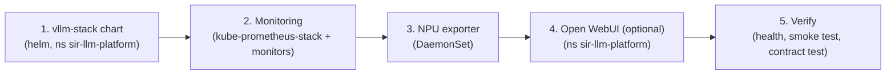
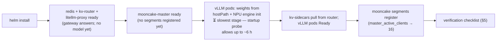

# Setup Guide

How to deploy (or re-deploy) the SIR LLM platform from scratch, verify it, and
operate it afterwards. Assumes you have cluster admin access.

> For *using* the deployed platform (API calls, clients, monitoring), see
> [user-guide.md](user-guide.md). For component rationale and figures, see
> [architecture.md](architecture.md).

## 1. Prerequisites

### 1.1 Tooling

- `kubectl` configured against the cluster
- `helm` 3.x
- Python 3 (stdlib only) for the contract test

### 1.2 Nodes

| Node role | Label / requirement | Runs |
|-----------|--------------------|------|
| Control-plane node | any schedulable node (pinned by hostname in `pin.nodeName`) | LiteLLM, kv-router, Redis, mooncake-master, Open WebUI |
| Phase-1 NPU nodes (×2) | label `llm-pool=qwen-38b-phase1`, 8 × Ascend 910B each | vLLM pods (2 per node, TP=4) + kv-sidecars |
| Phase-2 NPU nodes (optional) | label `llm-pool=qwen-38b-phase2`, 910B3 64 GB HBM | phase-2 vLLM pods |

- The **Ascend NPU device plugin** must be running (pods request
  `huawei.com/Ascend910` resources).
- Label the NPU pools if not already done:

  ```bash
  kubectl label node <p1-node> llm-pool=qwen-38b-phase1
  kubectl label node <p2-node> llm-pool=qwen-38b-phase2
  ```

  (The vLLM template also avoids nodes labeled `avoid=vllm`.)

### 1.3 Model weights (pre-staged)

vLLM mounts the model from a **hostPath** — the weights must already exist on
every node that runs vLLM pods:

```
/data/models/Qwen3.8-27B/     # the model directory (weights + tokenizer)
```

This is mounted read-only as `/model` in the pod (subPath `Qwen3.8-27B`).
`HF_HUB_OFFLINE=1` / `TRANSFORMERS_OFFLINE=1` are set — there is no model
downloading at startup.

### 1.4 Image egress / registry trust

- `vllm-ascend`, `litellm`, `redis` are pulled from `quay.io` / `ghcr.io` /
  `docker.io`; `kv-router` / `kv-sidecar` / `npu-exporter` from
  `ghcr.io/clyde-org/llm-la-icbc`.
- The pool nodes' containerd has direct egress to ghcr.io, so kubelet pulls
  normally (`IfNotPresent`). If a new node **cannot** pull from ghcr.io (e.g.
  tmp0306 `7.150.x.x` nodes), the egress MITM gateway's CA must be added to
  containerd's trust store first:

  ```bash
  mkdir -p /etc/containerd/certs.d/ghcr.io
  cp /etc/pki/ca-trust/extracted/pem/tls-ca-bundle.pem /etc/containerd/certs.d/ghcr.io/ca.crt
  ```

  (Same fix for docker hosts: `/etc/docker/certs.d/ghcr.io/ca.crt`.)

## 2. Installation



### 2.1 Serving stack (Helm chart `./vllm-stack`)

```bash
helm upgrade --install vllm ./vllm-stack \
  -n sir-llm-platform --create-namespace \
  --set mooncake.enabled=true --set mooncake.attachToVllm=true
```

- Release name: `vllm`, namespace: `sir-llm-platform`.
- Everything else is chart default (`vllm-stack/values.yaml` reproduces the live
  deployment); the **only** live overrides are the two `mooncake` flags, which
  deploy the Mooncake master and attach the store connector to the vLLM pods.
- Verify the effective values afterwards:

  ```bash
  helm get values vllm -n sir-llm-platform
  ```

What this creates (namespace `sir-llm-platform`):

| Resource | Kind | Notes |
|----------|------|-------|
| `model-registry`, `litellm-config`, `vllm-fingerprint-mw`, `mooncake-store-config` | ConfigMaps | registry + gateway config |
| `redis` | Deployment + Service | ClusterIP :6379, pinned to control-plane node |
| `router-service` | Deployment + Service + RBAC | ClusterIP :8080/:5559, pinned |
| `vllm-qwen3-8b` | Deployment (×4) + Service | phase-1 pods, nodeSelector `llm-pool: qwen-38b-phase1` |
| `litellm-proxy` | Deployment + Service | NodePort 30400, pinned |
| `vllm-qwen3-8b-claude` | Service | ClusterIP view of phase-1 pods (Anthropic upstream) |
| `mooncake-master` | Deployment + Service | :50051/:8080/:9003, pinned (when enabled) |
| podmonitors | (inert today — see architecture §7) | label mismatch; active monitors live in `monitoring` |

### 2.2 Monitoring

```bash
# Prometheus + Grafana (kube-prometheus-stack) in namespace monitoring
helm upgrade --install prometheus prometheus-community/kube-prometheus-stack \
  -n monitoring --create-namespace \
  -f monitoring/prometheus/values.yaml

# NPU exporter DaemonSet (namespace npu-exporter)
kubectl apply -f monitoring/npu-exporter.yaml

# ServiceMonitors/PodMonitors + litellm bearer secret (namespace monitoring)
kubectl apply -f monitoring/servicemonitors.yaml
```

- The Grafana dashboard is **not** installed by the chart — it is provisioned from
  a ConfigMap:

  ```bash
  kubectl apply -f monitoring/dashboards/sir-llm-platform-vllm-configmap.yaml
  ```

  (Grafana persistence is disabled; this ConfigMap + the `grafana-sc-dashboard`
  sidecar is what keeps the dashboard across restarts.)

### 2.3 Open WebUI (optional chat GUI)

```bash
kubectl apply -f deepseek-harness/open-webui.yaml
kubectl rollout status deploy/open-webui -n sir-llm-platform
```

- NodePort **30401**; first registered account becomes admin.
- Pinned to `gui-host=true` nodes; `emptyDir` storage (no StorageClass on this
  cluster — pod recreation resets the admin account and history).
- `HF_HUB_OFFLINE=1`: pods have no egress, so RAG embeddings are disabled (chat is
  unaffected).

## 3. First-boot expectations

What to expect after `helm install` (times are indicative; the only hard number is
the ~6 h startup-probe budget for vLLM):



- **vLLM startup is slow**: model load + engine init on NPUs takes a while; the
  startup probe allows up to ~6 h (`initialDelaySeconds: 60`, `periodSeconds: 30`,
  `failureThreshold: 720`). Don't interpret a long `ContainerCreating`/`Running`
  window as failure — watch the pod logs instead.
- Once the 4 phase-1 pods are Ready, the full path is live. Expected pod set:

  ```
  vllm-qwen3-8b-<hash> x4     (each: vllm + kv-sidecar)
  router-service-<hash> x1
  litellm-proxy-<hash> x1
  redis-<hash> x1
  mooncake-master-<hash> x1
  ```

## 4. Phase-2 rollout (262k pool)

The phase-2 pool (910B3 64 GB HBM nodes) is **additive** and **off by default**.
Roll it out in three phases (each is a plain `helm upgrade`):

```bash
# Phase 1 - single-pod validation on one node
helm upgrade vllm ./vllm-stack -n sir-llm-platform \
  --set mooncake.enabled=true --set mooncake.attachToVllm=true \
  --set phase2.enabled=true --set phase2.pinnedNode=node3

# Phase 2 - two pods per node
helm upgrade vllm ./vllm-stack -n sir-llm-platform \
  --set mooncake.enabled=true --set mooncake.attachToVllm=true \
  --set phase2.enabled=true --set phase2.replicas=4

# Phase 3 - raise the context limit to 262k
helm upgrade vllm ./vllm-stack -n sir-llm-platform \
  --set mooncake.enabled=true --set mooncake.attachToVllm=true \
  --set phase2.enabled=true --set phase2.replicas=4 \
  --set phase2.maxModelLen=262144
```

> ⚠️ Helm values are replaced, not merged — always re-pass the mooncake flags (and
> any other overrides) on every `helm upgrade`.

Characteristics of the phase-2 pool:

- Served under its own name `qwen3.8-27b-262k` (old pool keeps `qwen3.8-27b`);
  users pick the model explicitly.
- **Deliberately mooncake-free**: no `--kv-transfer-config`, no
  `MOONCAKE_CONFIG_PATH`, no `/etc/mooncake` volume (the store is not attached to
  that pool; see architecture §5 and DEPLOYMENT.md).
- `--kv-events-config` and the kv-sidecar **are** kept — same sidecar, same
  router; the router discovers the new pods via the shared `component=vllm` label
  and per-pod KV events.
- The router's `ANTHROPIC_UPSTREAMS` map and LiteLLM's model list grow
  automatically (chart-templated).

## 5. Verification checklist

Run these in order after install (or after any significant change):

```bash
# 1. Pods
kubectl get pods -n sir-llm-platform -o wide

# 2. Services
kubectl get svc -n sir-llm-platform

# 3. Gateway health (from any machine that reaches a node IP)
curl -s -H "Authorization: Bearer sk-qwen38b-local" http://<NODE_IP>:30400/health

# 4. Smoke test - OpenAI path
curl -s -X POST http://<NODE_IP>:30400/v1/chat/completions \
  -H "Content-Type: application/json" \
  -H "Authorization: Bearer sk-qwen38b-local" \
  -d '{"model": "qwen3.8-27b", "messages": [{"role": "user", "content": "Reply with PONG"}], "max_tokens": 32}'

# 5. Smoke test - Anthropic path
curl -s -X POST http://<NODE_IP>:30400/v1/messages \
  -H "Content-Type: application/json" \
  -H "x-api-key: sk-qwen38b-local" \
  -H "anthropic-version: 2023-06-01" \
  -d '{"model": "qwen3.8-27b", "max_tokens": 32, "messages": [{"role": "user", "content": "Reply with PONG"}]}'

# 6. Model list (shows both pools when phase-2 is enabled)
curl -s -H "Authorization: Bearer sk-qwen38b-local" http://<NODE_IP>:30400/v1/models
```

**Client contract test** (overflow behaviour, both pools, both paths — 13 checks,
stdlib-only; one check runs a real ~115k-token prefill and can take a minute on a
busy pool):

```bash
python3 scripts/test-ctx-guard.py            # all 13 checks
CTX_TEST_SKIP_SLOW=1 python3 scripts/test-ctx-guard.py   # skip the near-cap prefill
```

**Mooncake health** (when enabled):

```bash
# 16 active clients = 4 pods x 4 TP ranks
curl -s "http://<NODE_IP>:30900/api/v1/query?query=master_active_clients"

# puts must complete: end should track start (revoke ~ start = broken data path)
curl -s "http://<NODE_IP>:30900/api/v1/query?query=master_batch_put_end_requests_total"
curl -s "http://<NODE_IP>:30900/api/v1/query?query=master_batch_put_start_requests_total"
```

**Prometheus targets** (everything above should be UP):

```bash
curl -s http://<NODE_IP>:30900/api/v1/targets \
  | jq '.data.activeTargets[] | select(.labels.namespace == "sir-llm-platform") | {job: .labels.job, health}'
```

## 6. Day-2 operations

### 6.1 Upgrading the chart

```bash
helm get values vllm -n sir-llm-platform      # 1. capture current overrides
helm upgrade vllm ./vllm-stack -n sir-llm-platform \
  --set mooncake.enabled=true --set mooncake.attachToVllm=true   # 2. re-apply them (+ new flags)
helm history vllm -n sir-llm-platform         # 3. confirm new revision
```

- `vllm-stack/values/` contains **stale** files (`qwen3-8b.yaml`,
  `values-qwen38b.yaml`) from an older multi-model schema — do **not** use them
  for this deployment.
- Router/sidecar image tags are pinned in `values.yaml`
  (`router.imageTag=d0eec27a`, `sidecar.imageTag=cc0b976d`). **Roll them
  together** — they share the wire contract. (A sidecar build `d0eec27a` exists
  with improved error propagation; the roll is a one-line tag bump + upgrade when
  capacity allows — see [docs/pool-router-sidecar-changes.md](../pool-router-sidecar-changes.md).)

### 6.2 Restart / scale

```bash
kubectl rollout restart deployment/litellm-proxy -n sir-llm-platform
kubectl rollout restart deployment/router-service -n sir-llm-platform
kubectl rollout restart deployment/vllm-qwen3-8b -n sir-llm-platform   # rolling; slow (model load)

kubectl scale deployment/vllm-qwen3-8b -n sir-llm-platform --replicas=4
```

### 6.3 Logs

```bash
kubectl logs -n sir-llm-platform -l app=litellm-proxy --tail=100
kubectl logs -n sir-llm-platform -l app=router-service --tail=100
kubectl logs -n sir-llm-platform -l app=vllm-qwen3-8b --tail=100
# a vLLM pod has two containers:
kubectl logs -n sir-llm-platform <pod> -c kv-sidecar --tail=100
```

### 6.4 Reaching internal services from a workstation

```bash
kubectl -n sir-llm-platform port-forward svc/router-service 8080:8080
kubectl -n sir-llm-platform port-forward svc/redis 6379:6379
kubectl -n sir-llm-platform port-forward svc/vllm-qwen3-8b 8200:8200
kubectl -n sir-llm-platform port-forward svc/mooncake-master 9003:9003
```

## 7. Rollback

```bash
# Detach the Mooncake store from vLLM only (master stays up)
helm upgrade vllm ./vllm-stack -n sir-llm-platform \
  --set mooncake.enabled=true --set mooncake.attachToVllm=false

# Remove Mooncake entirely
helm upgrade vllm ./vllm-stack -n sir-llm-platform \
  --set mooncake.enabled=false --set mooncake.attachToVllm=false

# Disable the phase-2 pool (phase-1 is untouched)
helm upgrade vllm ./vllm-stack -n sir-llm-platform \
  --set mooncake.enabled=true --set mooncake.attachToVllm=true \
  --set phase2.enabled=false
```

Chart-wide rollback to a previous revision: `helm rollback vllm <rev> -n sir-llm-platform`.

## 8. Security notes

- The gateway is protected **only** by the static master key `sk-qwen38b-local`
  on the lab network — anyone who knows it can call the model. Add a gateway/OAuth
  proxy in front if the platform ever leaves the lab.
- The key is committed throughout this repo (values, configs, docs) — treat the
  repo as lab-internal.
- The `-claude` Service (ClusterIP) has **no auth** and accepts any non-empty key;
  it is only reachable from inside the cluster (or via port-forward).
- The router's Redis has no auth (ClusterIP, lab network).
