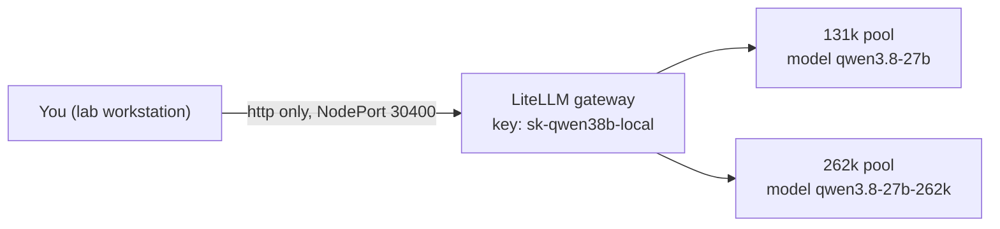
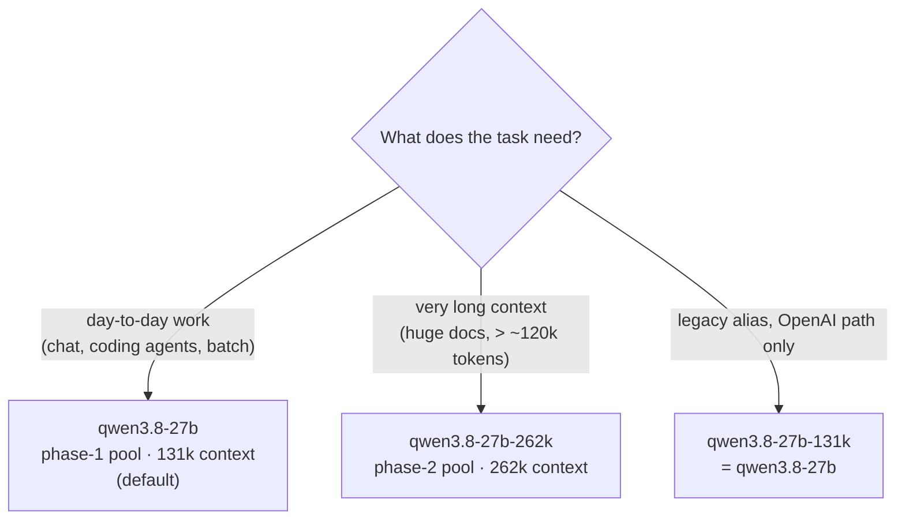

# User Guide

Day-to-day use of the SIR LLM platform: calling the API, choosing a model/pool,
wiring up coding agents (Claude Code, pi), chat GUIs, monitoring, and
troubleshooting.

- Architecture and rationale: [architecture.md](architecture.md)
- Installation/operations: [setup.md](setup.md)

## 1. Access & authentication

| What | Value |
|------|-------|
| Gateway base URL | `http://<NODE_IP>:30400` (any reachable node; e.g. `7.242.101.107`) |
| API key | `sk-qwen38b-local` (LiteLLM master key — it is **not** an Anthropic key) |
| OpenAI path | `POST /v1/chat/completions`, header `Authorization: Bearer <key>` |
| Anthropic path | `POST /v1/messages`, header `x-api-key: <key>` (+ `anthropic-version: 2023-06-01`) |



Notes:

- If your workstation reaches the cluster **only through a local HTTP proxy**
  (`127.0.0.1:3128`), make sure the node IP is in `NO_PROXY` (direct access works
  best); if you have direct access with no proxy, no proxy env is needed.
- Router/Redis/vLLM are **not** exposed. To debug them, `kubectl port-forward`
  (recipes in [setup.md → Day-2 operations](setup.md#64-reaching-internal-services-from-a-workstation)).

## 2. Calling the API

### 2.1 OpenAI-compatible (`/v1/chat/completions`)

```bash
curl -s -X POST http://<NODE_IP>:30400/v1/chat/completions \
  -H "Content-Type: application/json" \
  -H "Authorization: Bearer sk-qwen38b-local" \
  -d '{
    "model": "qwen3.8-27b",
    "messages": [{"role": "user", "content": "Hello"}],
    "max_tokens": 100
  }'
```

Python (official `openai` package):

```python
from openai import OpenAI

client = OpenAI(
    base_url="http://7.242.101.107:30400/v1",
    api_key="sk-qwen38b-local",
)

resp = client.chat.completions.create(
    model="qwen3.8-27b",
    messages=[{"role": "user", "content": "Hello"}],
    max_tokens=100,
)
print(resp.choices[0].message.content)
```

Streaming works as usual (`stream=True`); tool calling is enabled
(`qwen3_coder` parser) and reasoning parsing is active (`qwen3` reasoning parser —
the model can think before answering; see `/think off` in §4.3 for the CLI way to
disable it).

There is also a raw pass-through at `POST /raw/v1/chat/completions` (same auth)
that skips LiteLLM's model-list handling and goes straight to the router.

### 2.2 Anthropic Messages (`/v1/messages`)

```bash
curl -s -X POST http://<NODE_IP>:30400/v1/messages \
  -H "Content-Type: application/json" \
  -H "x-api-key: sk-qwen38b-local" \
  -H "anthropic-version: 2023-06-01" \
  -d '{
    "model": "qwen3.8-27b",
    "max_tokens": 100,
    "messages": [{"role": "user", "content": "Hello"}]
  }'
```

Python (official `anthropic` package):

```python
from anthropic import Anthropic

client = Anthropic(
    base_url="http://7.242.101.107:30400",
    api_key="sk-qwen38b-local",
)

msg = client.messages.create(
    model="qwen3.8-27b",
    max_tokens=100,
    messages=[{"role": "user", "content": "Hello"}],
)
print(msg.content[0].text)
```

The body (and streaming) is forwarded **verbatim** to vLLM, which implements the
Anthropic Messages API natively — so standard Anthropic-SDK clients just work.
This is the path Claude Code uses (§4.1).

### 2.3 Model & pool selection



| Model name | Pool | Context limit | Notes |
|------------|------|---------------|-------|
| `qwen3.8-27b` | phase-1 (default) | 131,072 | the everyday model |
| `qwen3.8-27b-262k` | phase-2 | 262,144 | long-context work |
| `qwen3.8-27b-131k` | phase-1 | 131,072 | alias — **OpenAI path only** (404 on `/v1/messages`) |

The `model` field in the request body is the pool selector on **both** paths —
there is only ever one base URL. List what's available with:

```bash
curl -s -H "Authorization: Bearer sk-qwen38b-local" http://<NODE_IP>:30400/v1/models
```

### 2.4 Context limits & what happens on overflow

Both pools hard-reject requests where `prompt + max_tokens` exceeds the pool limit.
The router's **context guard** enforces this *up front* with a real **400** in
vLLM's error shape:

```json
{"error": {"message": "prompt is too long: 135000 tokens > 131072 maximum", ...}}
```

Why this matters to you: agent clients (pi, Claude Code) detect exactly this error
shape and **auto-compact + continue** instead of stalling. Before the guard, the
same overflow came back as a fake 200 with an empty stream, and sessions silently
died — the before/after sequence is drawn in
[architecture.md §6](architecture.md#6-context-guard-ctx_guard).

Practical rules:

- Keep `max_tokens` ≤ 8192 for the 131k pool (that's the per-request output
  budget the platform is tuned for).
- Long conversations: let your client's compaction handle it (it's pre-tuned in
  the shipped configs). A session that's *already* past its pool's limit cannot be
  rescued by compacting — start a fresh one (`/clear` in Claude Code).
- Verify the overflow contract any time the platform changes:

  ```bash
  python3 scripts/test-ctx-guard.py          # 13 checks, both pools, both paths
  ```

## 3. Chat GUIs & CLI

| Option | Where | Install | Notes |
|--------|-------|---------|-------|
| **Open WebUI** | `http://<NODE_IP>:30401` (in-cluster, NodePort) | already deployed (`deepseek-harness/open-webui.yaml`) | most full-featured; first account = admin; history resets on pod recreation (emptyDir) |
| **LiteLLM Swagger UI** | `http://<NODE_IP>:30400/` | none | API playground, not a chat UI |
| **deepseek-chat harness** | local CLI | `cd deepseek-harness && ./deepseek-chat` | stdlib-only Python, preconfigured for this cluster; `/think on|off` toggles reasoning |
| LibreChat / NextChat / AnythingLLM / LM Studio | self-hosted / desktop | see [deepseek-harness/README.md](../../deepseek-harness/README.md) | any OpenAI-compatible client works: base URL `http://<NODE_IP>:30400/v1`, key `sk-qwen38b-local` |

`deepseek-chat` quick start:

```bash
./deepseek-chat                          # interactive REPL
./deepseek-chat -p "hello"               # one-shot
./deepseek-chat --system "You are terse." -p "hi"
```

## 4. Coding agents

### 4.1 Claude Code

Full rationale: [claude-code/README.md](../../claude-code/README.md).

```bash
# back up any existing file first, then:
cp claude-code/settings.qwen3-8b.json ~/.claude/settings.json
```

(or place it in a project's `.claude/settings.json` / `.claude/settings.local.json`
to keep your normal provider at user level.)

What the template sets (and why it's not optional):

| Setting | Value | Why |
|---------|-------|-----|
| `ANTHROPIC_BASE_URL` | `http://7.242.101.107:30400` | one stable base URL; pool chosen by model name |
| `ANTHROPIC_API_KEY` | `sk-qwen38b-local` | LiteLLM master key (not an Anthropic key) |
| `ANTHROPIC_MODEL` | `qwen3.8-27b` | default → 131k pool |
| `ANTHROPIC_DEFAULT_SONNET_MODEL` | `qwen3.8-27b-262k` | Sonnet tier → 262k pool for long-context work |
| `ANTHROPIC_DEFAULT_OPUS_MODEL` | `qwen3.8-27b` | on custom endpoints "Default (recommended)" resolves to the opus tier — keeping it on 131k makes the *default* the 131k pool |
| `CLAUDE_CODE_AUTO_COMPACT_WINDOW` | `131072` | **required**: Claude Code assumes 200k for unknown models; without this, long sessions 500 *before* autocompact can fire |
| `CLAUDE_CODE_MAX_OUTPUT_TOKENS` | `8192` | matches the platform's per-request output budget |

The `/model` picker shows the real served names:

```
Default (recommended)  qwen3.8-27b            (131k pool)
qwen3.8-27b           Custom Opus model      (131k pool)
qwen3.8-27b-262k      Custom Sonnet model    (262k pool)
qwen3.8-27b           Custom Haiku model     (131k pool)
```

Verify: `claude -p "Reply with PONG"`.

Pitfalls (details in the linked README):

- Don't "fix" `maximum context length is 131072` errors by raising vLLM
  `maxModelLen` or with `CLAUDE_CODE_MAX_CONTEXT_TOKENS` (that var only works when
  `DISABLE_COMPACT` is set, which *disables* compaction).
- If pointing the session at the 262k pool, raise
  `CLAUDE_CODE_AUTO_COMPACT_WINDOW` to `240000` and restart the session.
- Fallback if you can't reach NodePort 30400: port-forward
  `svc/vllm-qwen3-8b-claude` and set `ANTHROPIC_BASE_URL=http://127.0.0.1:8200`
  (unauthenticated, any non-empty key).

### 4.2 pi (pi-coding-agent)

Full rationale: [pi/README.md](../../pi/README.md).

```bash
npm install -g @earendil-works/pi-coding-agent

mkdir -p ~/.pi/agent
cp pi/models.json    ~/.pi/agent/models.json     # merge if you already have providers
cp pi/settings.json  ~/.pi/agent/settings.json
```

Key values (and why they differ from stock):

| File | Field | Value | Why |
|------|-------|-------|-----|
| models.json | `baseUrl` | `http://7.242.101.107:30400/v1` | OpenAI-compatible route |
| models.json | `contextWindow` | `131072` | the real vLLM limit |
| models.json | `maxTokens` | `8192` | **do not raise** — pi's input wall is `contextWindow − maxTokens`; stock values put it at ~33k and long sessions die there |
| settings.json | `compaction.reserveTokens` | `32768` | compaction triggers at 98,304 tokens — well before the 122,880 input wall |
| settings.json | `compaction.keepRecentTokens` | `20000` | recent context kept verbatim around the cut point |

Verify:

```bash
pi --list-models qwen      # should list sirlab / qwen3.8-27b
pi -p "Reply with PONG"
```

Then just run `pi`. `models.json` is reloaded when you open `/model` in a session
(live-editable without restart).

### 4.3 Which agent for what

- **Claude Code** → Anthropic path (`/v1/messages`); pick pool per tier (sonnet =
  262k).
- **pi** → OpenAI path (`/v1/chat/completions`); single model entry, compaction
  tuned in settings.
- Both are pre-tuned for the 131k pool; for 262k work use the sonnet tier
  (Claude Code) or temporarily point the pi model at `qwen3.8-27b-262k` in
  `models.json` (and keep `maxTokens: 8192`).

## 5. Monitoring & observability

| Service | URL | Credentials |
|---------|-----|-------------|
| Prometheus | `http://<NODE_IP>:30900` | — |
| Grafana | `http://<NODE_IP>:30300` | `admin` / `prometheus-admin` |
| Pre-provisioned dashboard | `http://<NODE_IP>:30300/d/sir-llm-platform-vllm` | — |

The dashboard rows: **Gateway/HTTP** (rate, p50/p95/p99, errors), **Router/SLO**
(admission vs dispatch, queue, TTFT/E2E, SLO met/missed), **Load balancing**
(per-pod throughput, running requests, KV cache usage), **Cache & Speculative
decoding** (local prefix hits, external store hits, MTP acceptance), **Reliability
& preemption**, **NPU hardware** (AICore utilization, HBM, temperature, power,
ECC errors — filtered to the two phase-1 nodes).

Useful PromQL (Prometheus UI):

```promql
rate(vllm:request_success_total[5m])                                # request rate
vllm:kv_cache_usage_perc                                           # KV cache pressure
router_central_queue_length                                        # router queue depth
histogram_quantile(0.95, rate(router_request_e2e_seconds_bucket[5m]))  # P95 E2E
npu_chip_info_hbm_used_memory / npu_chip_info_hbm_total_memory     # HBM usage
master_allocated_bytes / master_total_capacity_bytes               # Mooncake pool fill
rate(master_batch_put_end_requests_total[5m]) / rate(master_batch_put_start_requests_total[5m])  # store put health (1.0 = good)
```

Sanity checks from the command line:

```bash
# router backend status (after port-forward)
kubectl -n sir-llm-platform port-forward svc/router-service 8080:8080 &
curl -s http://127.0.0.1:8080/health | jq '.backends'

# mooncake: expect 16 active clients (4 pods x 4 TP ranks), 128 GiB pool
curl -s "http://<NODE_IP>:30900/api/v1/query?query=master_active_clients"
```

Full metric tables: [monitoring/README.md](../../monitoring/README.md).

## 6. Troubleshooting quick reference

| Symptom | First check | Fix / notes |
|---------|-------------|-------------|
| LiteLLM returns 401 | auth header | use `Authorization: Bearer sk-qwen38b-local` (or `x-api-key` on `/v1/messages`) |
| `API Error: 500 ... maximum context length is 131072` in Claude Code | session already too long | autocompact misfire class — see §4.1 pitfalls; fresh session with `/clear` |
| Agent session stalls with empty replies on long context | overflow handling | run `python3 scripts/test-ctx-guard.py`; expect real 400s, not fake 200s |
| vLLM pods stuck `ContainerCreating`/`Running` for a long time | `kubectl logs ... -c vllm --tail=50` | model load is slow; startup probe allows ~6 h — not a failure |
| vLLM pod CrashLoopBackOff with `Address already in use` / `Initialize MooncakeDistributedStore failed` | mooncake env | keep `mooncake.legacyRpcPortBinding: false` (auto ports + legacy mode = guaranteed EADDRINUSE). Full root cause: [DEPLOYMENT.md](../../DEPLOYMENT.md#mooncake-kv-cache-store) |
| Mooncake: segments registered but `put_end ≈ 0`, `External prefix cache hit rate: 0.0%` | connector/protocol | must be `AscendStoreConnector` + `protocol: "ascend"` on this image; `tcp` is the broken path |
| Stale mooncake segment registrations after pod restarts | restart order | restart **mooncake-master first**, then `kubectl rollout restart deployment/vllm-qwen3-8b` |
| Router CrashLoopBackOff | router logs | historical cause: missing tokenizer deps — router now runs `KV_AWARE=false`; don't re-enable without the deps |
| `/v1/messages` returns 404 for `qwen3.8-27b-131k` | model name | the alias is OpenAI-path only; use `qwen3.8-27b` on the Anthropic path |
| Config change to LiteLLM didn't take effect | pod template | the `checksum/litellm-config` annotation should trigger a rollout; force with `kubectl rollout restart deployment/litellm-proxy` |
| New node can't pull images from ghcr.io | registry CA | add the egress-gateway CA to `/etc/containerd/certs.d/ghcr.io/ca.crt` (see [setup.md §1.4](setup.md#14-image-egress--registry-trust)) |
| Need to poke router/redis/vLLM directly | not exposed | `kubectl port-forward` — recipes in [setup.md §6.4](setup.md#64-reaching-internal-services-from-a-workstation) |

Deep troubleshooting (Mooncake root-cause history, exact error signatures):
[DEPLOYMENT.md → Troubleshooting](../../DEPLOYMENT.md#troubleshooting).

## 7. FAQ

- **Why is there only one external port?** Security surface + simplicity: all
  traffic is authenticated in one place (LiteLLM); everything else is internal by
  design (see architecture §9, invariants).
- **Why can't I use `qwen3.8-27b-131k` with Claude Code?** The Anthropic path
  forwards the body verbatim; the alias is rewritten only by LiteLLM on the
  OpenAI path. Use the canonical `qwen3.8-27b`.
- **Why is KV-aware routing off?** The router image lacks the extra tokenizer
  deps for inline KV hashing; `LEN_AWARE` short-first is the active policy, and
  KV-affinity routing (from live KV events) still gives the prefix-cache fast
  path, with the Mooncake store as cross-pod fallback.
- **Can I add another model?** Yes, in principle — the router/LiteLLM model list
  and the `ANTHROPIC_UPSTREAMS` map are chart-templated (see the phase-2 pool as
  the example). New pool = new nodeSelector + served name + `max-model-len`.
- **Where do I report problems?** File them against this repo (`sir-llm-platform`);
  include `kubectl get pods -n sir-llm-platform -o wide`, the relevant logs, and
  the output of `python3 scripts/test-ctx-guard.py`.
