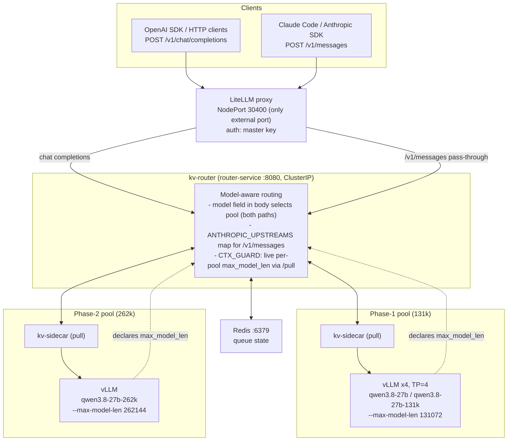
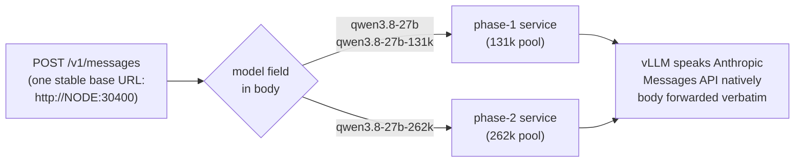
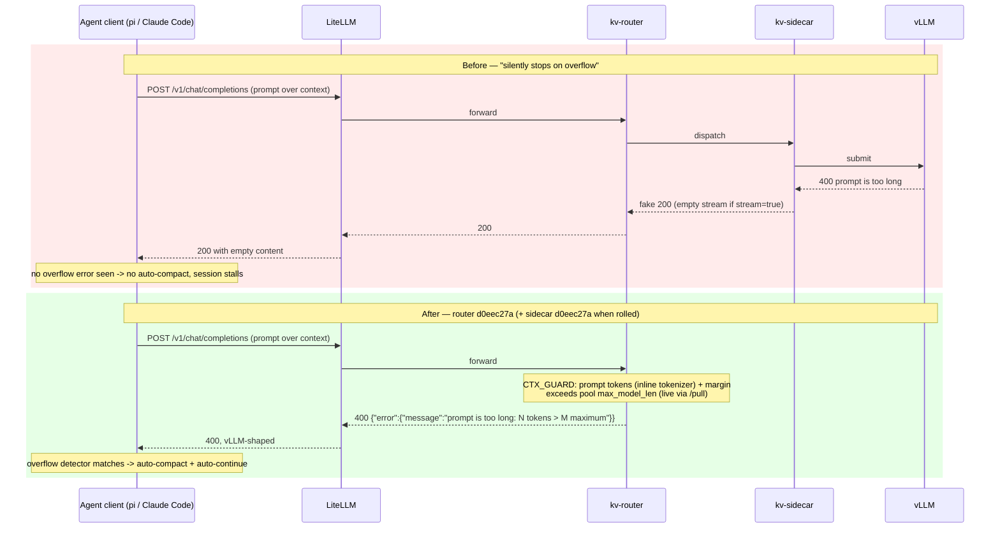

# Router & sidecar changes for multi-pool (131k / 262k) operation

*Summary of the kv-router / kv-sidecar work (commits `ec649cc`, `ab91d05`, `1353fc9`, `3bd5b6d` + bundled chart work in `sir-llm-platform`, currently unpushed) that makes the stack serve from two deployment pools.*

## Context

The stack now serves the same Qwen3.8-27B weights from **two vLLM pools**:

| Pool | Nodes | Served model name | `max-model-len` |
|------|-------|-------------------|-----------------|
| Phase 1 | `llm-pool: qwen-38b-phase1` (2 nodes, 4 pods, TP=4) | `qwen3.8-27b` (+ `qwen3.8-27b-131k` alias on OpenAI path) | 131072 |
| Phase 2 | `llm-pool: qwen-38b-phase2` | `qwen3.8-27b-262k` | 262144 |

All traffic still flows through **one** kv-router (`litellm → kv-router → kv-sidecar → vllm`). The changes below are what make a single router/sidecar pair serve both pools, and make agent clients (pi, Claude Code) behave correctly when a request overflows a pool's context window.

Both images come from `ghcr.io/clyde-org/llm-la-icbc`, **pinned by tag** (never `:latest`). Current state: **router `d0eec27a`**, **sidecar `cc0b976d`** (sidecar `d0eec27a` built & pushed, roll pending — see [Open item](#open-item)).

## Architecture

Key properties:

- The router discovers both pools via `LABEL_SELECTOR=component=vllm` + per-pod KV-cache events (`--kv-events-config`, ZMQ); the **same** `kv-sidecar` runs in every vLLM pod in both pools.
- **Per-pool limits flow live from the pods**: each endpoint declares its `max_model_len` to the router via `/pull`, so len-aware routing and CTX_GUARD are automatically correct per pool with no static config.
- Control plane (LiteLLM, router, Redis) is pinned to one node; LiteLLM NodePort 30400 is the only externally exposed port.

## How a request picks its pool

### OpenAI path (`/v1/chat/completions`)

The `model` field in the body is the pool selector — `qwen3.8-27b` / `qwen3.8-27b-131k` land on the 131k pool, `qwen3.8-27b-262k` on the 262k pool. The `-131k` alias is LiteLLM-only (rewritten before reaching the router).

### Anthropic path (`/v1/messages`) — new model-aware raw-forward

- **New `POST /v1/messages` endpoint on the kv-router** (router image `d66e429`, commit `ec649cc`): forwards the Anthropic request/response — including streaming — verbatim to the selected pool's vLLM (vLLM speaks the Anthropic Messages API natively).
- Pool selection via a new **`ANTHROPIC_UPSTREAMS`** env var: a JSON model→URL map, **templated by the chart** (`vllm-stack/templates/_helpers.tpl` → `03-router.yaml`), so it grows automatically as pools are added.
- Anthropic clients (Claude Code) now use **one stable base URL** — no more baking `/262k` into `ANTHROPIC_BASE_URL`. LiteLLM's `/v1/messages` pass-through was retargeted from the static 262k pool to this router endpoint; the legacy `/262k/v1/messages` static path is retained but **deprecated**.
- Caveat: the `-131k` alias 404s on the Anthropic path (raw forward, vLLM validates the model name). Canonical names (`qwen3.8-27b` / `qwen3.8-27b-262k`) are the supported selection there.
- Related: LiteLLM now carries a **checksum annotation** on its ConfigMap so config changes actually trigger a rollout (commit `d7fc8e7`) — previously a retargeted pass-through sat in the ConfigMap while the old pod kept serving.

## CTX_GUARD — real 400 for over-context requests

The headline bug: when vLLM rejected an oversized prompt, the sidecar pipeline turned the 400 into a **fake 200** (an empty stream when `stream=true`), so agent clients never saw the overflow error and silently stopped instead of auto-compacting and continuing.

Router-side (image `d0eec27a`, arm64 rebuild, commit `1353fc9`):

- Rejects over-context `/v1/chat/completions` **up front** with the exact vLLM error shape `prompt is too long: N tokens > M maximum` — the format pi's overflow detector matches, triggering auto-compaction + auto-continue.
- **Cap is read live per pool**: each pool's endpoints declare `max_model_len` in the router's `/pull` (131072 / 262144), so one router enforces the correct limit per pool. `CTX_GUARD_MAX_MODEL_LEN` pins a static cap when non-zero.
- `CTX_GUARD_MARGIN` (default 4096) is subtracted from the cap to cover chat-template/tool-schema tokens the flattened prompt undercounts. `N` = prompt tokens counted by the inline tokenizer (`transformers`+`tokenizers`; no sentencepiece needed for Qwen).
- **Fails open** (no rejection) until the first endpoint declares a cap or the tokenizer is unavailable. Rejections logged as `[API] ctx_guard reject model=... max_tokens=...`.
- New Helm knobs: `router.ctxGuard` / `router.ctxGuardMargin` / `router.ctxGuardMaxModelLen` (default `true` / `4096` / `0`).

Sidecar-side (same `d0eec27a` build):

- vLLM errors that **get past** the guard (estimation miss) are propagated as `result["error"]` and surfaced as **real error responses** instead of error text masquerading as model output.

## Other changes

- **arm64 rebuild + ghcr direct pull** (commit `ab91d05`): images are now pulled directly from ghcr by kubelet (pool nodes have containerd egress) — the manual "import into containerd by hand" step is obsolete. `d0eec27a` is the arm64 rebuild for the Ascend nodes (replaces `cc0b976d`).
- **Phase-2 pool template** (`vllm-stack/templates/09-vllm-phase2.yaml`, bundled in `ec649cc`): second vLLM deployment with its own nodeSelector (`llm-pool: qwen-38b-phase2`), served name (`qwen3.8-27b-262k`), and `--max-model-len` — running the **same sidecar** (pull mode, identical env contract). Deliberately mooncake-free; `--kv-events-config` and the sidecar are kept (independent of the Mooncake store).
- **Client contract test** (`scripts/test-ctx-guard.py`, commit `3bd5b6d`): stdlib-only, any user can run against the deployed LiteLLM endpoint. Verifies the full CTX_GUARD contract on **both pools**: 400 + vLLM-shaped message for over-context requests (streaming & non-streaming), oversized-`max_tokens` rejection, normal 200s, a real ~115k-token near-cap request that must NOT be false-rejected, and the Anthropic-path `maximum context length` error. All 13 checks pass against the live platform. The local pi-extension safety net was removed — the deployed router guard supersedes it.
- **Client-side consequence**: Claude Code tiers now map per pool (sonnet → 262k, default/opus/haiku → 131k), with `CLAUDE_CODE_AUTO_COMPACT_WINDOW` set to the pool's limit so compaction fires before the hard cap (see `claude-code/settings.qwen3-8b.json`).

## Open item

- **Sidecar `d0eec27a` roll**: built and pushed but **not rolled yet** — it changes error propagation and requires restarting **all vLLM pods across both pools**. Roll when capacity allows: one-line `sidecar.imageTag` bump in `values.yaml` → `helm upgrade`. Until then, the router's CTX_GUARD covers the common case (up-front rejection); the sidecar fix covers estimation misses that slip past it.
